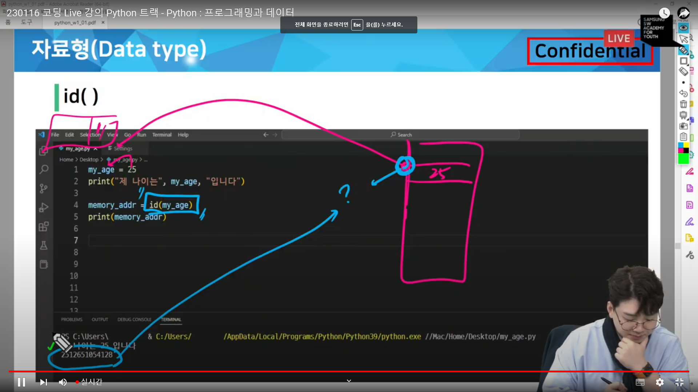
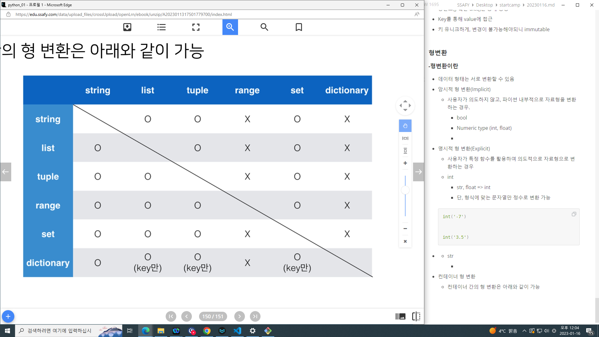

# 2023/01/16

## OT

### 월요일 시험

### 금요일 관통 pjt

### 11시에 라이브 끝나면 12시 20분까지 자습

 점심먹고 

 13시 30분 ~ 15시까지 질문 답변 시간./ 꼭 짚고가자 1시간정도

3시~5시까지 실습문제 >  교수님 or project.ssafy 온라인 실습실

5시~6시: 과제  (온라인 실습실) 과제는 매일. 원칙은 6시. 같이 풀이도 함. 정 안되면 과제 그 날 까지만 제출해라

**09:00 ~ 11:00 유튜브 라이브**

**11:00~ 12:20 자습**

**12:00~ 13:30 점심**

**13:30~ 15:00 질문 답변 시간, 꼭 짚고갈 것 1시간정도**

**15:00~ 17:00 실습문제**> 교수님or project.ssafy 

- lectures 에서 풀(git pull origin master) 받고

hws로 복사 붙여넣기 하고 작업하기.

실수했다? 그럼 걍 삭제하고 클론(git clone 주소) 다시 받으면댐.

실습문제는 필수 아니라서 그냥 집가서 해도댐

**17:00~ 18:00 과제 (온라인 실습실)** 과제는 매일. 원칙은 6시. 같이 풀이도 함. 정 안되면 과제 그 날까지만 제출.

## 프로그래밍이란?

#### - 소프트웨어를 개발하는 일

#### - 컴퓨터에게 명령하는 적절한 수행절차를 정의하고 이를 프로그래밍 언어로 표현하는 과정

## 프로그래밍 과정

#### 1. 컴퓨터에게 시키고 싶은 일을 정한다

- 내가 컴퓨터보다 잘하는 일은? 내가 하면 된다

- 컴퓨터가 나보다 잘하는 일은? 계산(computation), 저장 , 반복 등

#### 2. 컴퓨터가 이해할 수 있도록 수행 절차를 정의해서 표현한다.

- 컴퓨터는 어떻게 생각하고 이해할까?

- 컴퓨터는 어떻게 일을 처리할까?

- 수행 절차를 어떻게 표현할까?
  
  > 자료구조, 컴퓨터 구조, 이산수학, 네트워크 프로그래밍 언어론, 알고리즘 등. 

#### 3. 적절한 프로그래밍 언어를 선택하고, 언어를 이용해서 절차를 기술한다.

#### 4. 발생하는 오류를 수정한다.~~~~ 한 학기 내내 여기서 시간 다 보낼 예정,,~~~~

- 구문 오류(syntax error) 전반기  >> 문법 x 실행 x

- 논리 오류(semantic error) 후반기 >> 문법 o 실행o 내가 원하는 결과x

## 컴퓨팅 사고력

#### 1. 컴퓨터의 특성을 잘 이해한다

#### 2.문제해결능력을 기른다 `problem solving`

- 논리적 사고 == 큰문제를 작은 문제로 쪼개기

#### 3.프로그래밍 언어에 능숙해진다 `trial & error`

- 많이 해봐야 된다.

## python 시작하기

## 프로그래밍 언어란?

- 기계어의 대안으로 사람이 이해할 수 있는 새로운 언어 개발

- 사람이 이해할 수 있는 문자로 구성

- 기본적인 규칙과 문법 존재

## Python

#### ssafy는 3.9.12 버전

#### VS code

> MS가 만든 무료 개발용 텍스트 에디터(메모장)

#### 파이썬 개발 환경 종류

> IDE
> 
> Jupyter Notebook < 문법 학습을 위한 최적의 도구
> 
> IDLE
> 
> Pycharm<< 알고리즘 할 때 쓸 예정

- 파이썬을 어디서 개발할거니? 주로 vs코드 씀

## Python 기초문법

#### 변수와 식별자

##### 변수란?

- 데이터를 저장하기 위해서 사용

- 변수를 사용하면 복잡한 값들을  쉽게 사용할 수 있음(추상화)

```python
# 만약에 아메리카노 1잔을 시킨다면?
print(2000)
# 모카 2잔과 레
```

##### 추상화(변수를 사용해야 하는 이유)

- 코드의 가독성 증가

- 코드 수정이 용이해짐(아메리카노 가격이 변경되더라도 1곳만 수정하면 됨)

#### 변수의 할당

- 변수는 할당 연산자(=)를 통해 값을 할당(assignment)

- 같은 값을 동시에 할당할 수 있음

- 다른 값을 동시에 할당할 수 있음

```python
방법 1) 임시 변수 활용
x = 10
y = 20
tmp = x #tmp << 임시변수 빈거 만들어서 x를 옮기고 
x = y
y = tmp
print(x, y)
```

#### 식별자(Identifiers)

- 변수의 이름을 식별자라고 함(변수, 함수, 클래스 ---)

- 문제는, 그 변수의 이름을 어떻게 지어야하는가?(사이트도 존재)

- *읽기 쉽고 이해하기 쉬운 변수명이 최고임.

- 그래도 전 세계의 개발자들이 약속한 규칙이 있음. 

- 최소한 이정도는 지키자는 선

##### 변수 이름 규칙

- 식별자의 이름은 영문 알파벳, 언더스코어(_), 숫자로 구성

- 첫 글자에 숫자가 올 수 없음

- 길이 제한이 없고, 대소문자를 구별

- 내장 함수나 모듈 등의 이름도 사용 x 

> 동작을 예상 할 수 없게 임의로 값을 할당하게 되므로 범용적이지 않은 코드가 됨

#### 주석

- 코드의 실행에 영향을 미치지 않는 나만의 메모

- 여러 줄도 가능 ''' """ # 

- '주석다는 습관을 들이자'

> 코드에 대한 쉬운 이해
> 
> 유지보수 용이
> 
> 협업 용이
> 
> 당신의 기억력을 믿습니까? 주석 달자. 나와 동료를 위해.

#### 산술 연산자

- 기본적인 사칙연산 및 수식 계산

| 연산자 | 내용  |
| --- | --- |
| +   | 덧셈  |
| -   | 뺄셈  |
| *   | 곱셈  |
| /   | 나눗셈 |
| //  | 몫   |
| **  | 제곱  |

### 자료형(Data type)

#### 자료형과 메모리

- 데이터 10을 컴퓨터가 기억하는 과정

- 1. 10을 저장할 공간을 메모리에 만들고

- 2. 저장할 공간에 대한 주소를 할당받는다

- 3. 할당 받은 주소를 기억했다가(ex 4021555423)
  
  4. 10이라는 데이터를 해당 주소로 찾아가서 저장한다
  
  5. 이후에 10이 필요해지면 해당 주소로 가서 읽어온다
     
     > 주소를 기억하기가 힘들다.
     > 
     > 기억하기 쉬운 이름으로 바꿔서 부른다.
     > 
     > 그래서 변수를 사용//
     > 
     > my_score = 10
     > 
     > | my_score | 4021555423 |
     > | -------- | ---------- |
     > 
     > 변수 선언
     > 
     > 대부분의 프로그래밍에서 가장 먼저 하는 일
  
  ##### 정리
  
  프로그래밍에서 변수는 메모리의 주소를 기억하는 이름이다.
  
  우리는 변수를 이용해서 데이터를 기억한다
  
  자료형마다 차지하는 메모리의 크기가 다르다.

            **주소값이 궁금하면 id(보고싶은거)하면 볼수 있다**



#### 자료형 분류

- 수치형(Numeric Type)
  
  - int(정수, interger)
  
  - float(부동소수점, 실수, floating point)

#### 정수자료형(int)

- 여러 진수 표현 가능

#### 실수 자료형(float)

- 유리수와 무리수를 포함하는 '실수'를 다루는 자료형
  
  - 0.1, 100.0, -0,001등

- 소수를 이진수로 변환할 때, 무한대로 반복 됨.
  
  > 그래서 부동(둥둥 떠다닌다) 소수점을 .
  > 
  > 실수의 값을 처리할 때 의도하지 않은 값이 나올 수 있음
  > 
  > 그 이유는 부동 소수점 때문.
  
  - 값 비교하는 과정에서 정수가 아닌 실수면 조심.
  
  - 매우 작은 수보다 작은지를 확인하거나 math모듈 활용

#### 문자열 자료형의 정의

- 모든 문자는 str 타입

- 문자열은 작은따옴표나 큰따옴표를 활용하여 표기
  
  - 문자열을 묶을 때 동일한 문장부호를 활용
  
  - PEP8에서는 소스코드 내에서 하나의 문장부호를 선택하여 유지하도록 함

- 중첩 따옴표
  
  - 따옴표 안에 따옴표를 표현할 경우
  
  - 작은따옴표가 들어있는 경우 큰 따옴표로 문자열 생성
  
  - 큰따옴표가 들어있는 경우 작은따옴표로 문자열 생성

- 삼중 따옴표(Triple Quotes)
  
  - 작은따옴표나 큰따옴표를 삼중으로 사용
    
    - 따옴표 안에 따옴표를 넣을 때,
    
    - 여러 줄을 나눠 입력할 때 편리

- Escape sequence
  
  - 역슬래시(backslash)뒤에 특정 문자가 와서 특수한 기능을 하는 문자 조합(제어 시퀀스) (폰트에 따라 \가  ~~w~~(원화)로 표시되는 경우도 있으나 같은 의미)
  
  - | 예약문자 | 내용(의미)                                |
    | ---- | ------------------------------------- |
    | \n   | 줄바꿈                                   |
    | \t   | 탭                                     |
    | \r   | 캐리지 리턴  -'aaaaa\rbbb'를 프린트하면 bbbaaaaa |
    | \0   | 널(null)                               |
    | \\\  | \                                     |
    | \\'  | 단일인용부호(')                             |
    | \"   | 이중인용부호(")                             |

- 문자열 연산
  
  - 덧셈
  
  - 곱셈
  
  - f-strings : python 3.6+

```python
name = 'JB'
score = 100
print(f'{name}의 성적은 {score}이다.')
```

3.6버전 이전엔, 'Hello,{}.format(name)??'

#### None

- 파이썬 자료형 중 하나

- **값이 없음**을 표현하기 위해 **None** 타입이 존재

- **일반적으로 반환 값이 없는 함수에서 사용하기도 함**
  
  - ex) print() 
  
  - 

#### 불린형(Boolean)

- 논리 자료형으로 참과 거짓을 표현하는 자료형

- True 또는 False 를 값으로 가짐 (파이썬은 반드시 앞글자 대문자로 써주세용)

- 비교/논리 연산에서 활용됨

- 비교 연산자

> 비교연산자 = 수학에서 등호와 부등호와 동일한 개념
> 
> 주로 조건문에 사용되며 값을 비교할 때 사용
> 
> 결과는 True/False 값을 반환함

| 연산자    | 내용              |
| ------ | --------------- |
| <      | 미만              |
| <=     | 이하              |
| >      | 초과              |
| >=     | 이상              |
| ==     | 같음              |
| !=     | 같지않음            |
| is     | 객체 아이덴티티(OOP)   |
| is not | 객체 아이덴티티가 아닌 경우 |

```python
print(3 > 6) # False
print('3' != 3) # True
print('HI' == 'hi') # False
```

  논리 연산자

- 여러 가지 조건이 있을  때
  
  - 모든 조건을 만족하거나(And), 여러 조건 중 하나만 만족해도 될때(or) 특정코드를 실행하고 싶을 때 사용
  
  - Not  > True를 False로 False를 True로
  
  - and는 2개다 T일때
  
  - or는 둘중 하나라도 T면 T

- 논리연산자 주의할 점/ not 연산자
  
  - Falsy : False는 아니지만 False로 취급 되는 다양한 값
    
    - 0, 0.0, (), [], None, ''''(빈 문자열)
  
  - 논리 연산자도 우선순위가 존재
    
    - not, and, or 순으로 우선순위가 높음(괄호 쓰세요^^)

```python
0 == False
```

- 논리 연산자의 단축 평가
  
  - 결과가 확실한 경우 두번째 값은 확인하지 않고 첫번째 값 반환
  
  - and 연산에서 첫번째 값이 False인 경우 무조건 False > 첫번째 값 반환 (첫번째 False 두번째 Ture 해봤자 F.)
  
  - or 연산에서 첫번째 값이 True인 경우 무조건 True > 첫번째 값 반환 (첫번째 True 두번째 False 여도 T.)
  
  - 0은 False, 1은 True
  
  - ```python
    print(3 and 5) #5
    등등
    ```

#### 컨테이너란? (모아서 관리하겠다)

- 여러 개의 값(데이터)을 담을 수 있는 것(객체)으로, 서로 다른 자료형을 저장할 수 있음
  
  - 예시: List

- 컨테이너의 분류
  
  - 순서가 있는 데이터(Ordered) vs. 순서가 없는 데이터(Unordered)
  
  - 순서가 있다 != 정렬되어 있다. 
    
    [10, 8, 14, 18, 1]
  
  - 시퀀스형 (순서가 있는)
    
    - 리스트, 튜플, 레인지 
  
  - 비시퀀스형(순서가 없는)
    
    - 세트, 딕셔너리
  
  - 가변형 불변형

##### 리스트

- 리스트는 여러 개의 값을 순서가 있는 구조로 저장하고 싶을 때.

- 리스트는 대괄호[] 혹은 list()를 통해 생성

- ```python
  dust = [1, 2, 3]
  ```

```
- 파이썬에서는 어떠한 자료형도 저장할 수 있으며, 

- 생성된 이후 내용 변경이 가능> 가변 자료형

-  

- 리스트의 생성과 접근 Quiz. 127.p

```python
boxes = ['A', 'B', ['apple', 'banana', 'cherry']]
print(len(boxes)) # 3
print(boxes[2])  # ['apple', 'banana', 'cherry']
print(boxes[2][-1]) #cherry
print(boxes[-1][1][0]) #소문자 d
```

#### 튜플

- 튜플은 여러 개의 값을 순서가 있는 구조로 저장하고 싶을 때 사용
  
  - 리스트와의 차이점은 생성 후, 담고 있는 값 변경이 불가(불변자료형)

- 항상 소괄호 형태로 사용

- 소괄호() 혹은 tuple()을 통해 생성

- 튜플은 수정 불가능한(immutable) 시퀀스로 인덱스로 접근 가능
  
  - 값에 대한 접근은  my_tuple[i]

- 튜플 생성 주의사항
  
  - 단일 항목의 경우
    
    - 하나의 항목으로 구성된 튜플은 생성 시 값 뒤에 쉼표를 붙여야함 (연산자?와 구분하기 위해)
  
  - 복수 항목의 경우
    
    - 마지막 항목에 붙은 쉼표는 없어도 되지만, 넣는것을 권장

#### Range

- 숫자의 시퀀스를 나타내기 위해 사용

- 주로 반복문과 함께 사용됨

- Range의 기본 사용 방법
  
  - 기본형 : range(n)
    
    - 0부터 n-1까지의 숫자의 시퀀스
  
  - 범위 지정: range(n, m)
    
    - n부터 m-1까지의 숫자의 시퀀스

#### 슬라이싱 연산자

##### 시퀀스를 특정 단위로 슬라이싱

- 인덱스와 콜론을 사용하여 문자열의 특정 부분만 잘라낼 수 있음

- 슬라이싱을 이용하여 문자열을 나타낼 때 콜론을 기준으로 앞 인덱스에 해당하는 문자는 포함되지만 뒤 인덱스에 해당 문자는 미포함

- p.137

#### 비시퀀스형 컨테이너

##### - 딕셔너리의 정의

- 키-값(Key-value)쌍으로 이뤄진 자료형(3.7부터는 ordered, 이하 버전은 unordered) : 이제는 순서를 보장해준다

- 하지만 슬라이싱 인덱싱 불가능하므로 비시퀀스형.

- Dictionary의 키(Key)
  
  - Key는 변경 불가능한 데이터(immutable)만 활용 가능
    
    - string, integer, float, boolean, tuple, range
      
      *시험나오기 딱 좋음* 딕셔너리로 

- 각 키의 값
  
  - 어떠한형태든 관계없음

##### -딕셔너리 생성

- 중괄호{} 혹은 dict()을 통해 생성

- Key를 통해 value에 접근

- 키 유니크하게, 변경이 불가능해야되니 immutable

#### 형변환

##### -형변환이란

- 데이터 형태는 서로 변환할 수 있음

- 암시적 형 변환(Implicit)
  
  - 사용자가 의도하지 않고, 파이썬 내부적으로 자료형을 변환하는 경우. 
    
    - bool
    
    - Numeric type (int, float)
    
    - 

- 명시적 형 변환(Explicit)
  
  - 사용자가 특정 함수를 활용하여 의도적으로 자료형으로 변환하는 경우
  
  - int
    
    - str, float => int
    
    - 단, 형식에 맞는 문자열만 정수로 변환 가능
  
  ```python
  int('-7')
  ```

  int('3.5')

```
- str

- int, float, list, tuple, dict => str


- 컨테이너 형 변환

- 컨테이너 간의 형 변환은 아래와 같이 가능




보면 걍 안되는거(range, dictionary) 되는데 키만 되는거


Pip install notebook

>

jupyter notebook


tasklist


```


code ~/.bashrc

source ~/.bashrc


주피터노트북 - 컨트롤 엔터 누르면 코드 실행.

                         알트+엔터 누르면 실행하고 밑에칸으로 이동

                        b 누르면 아래 한줄 추가

                        a 누르면 위에 한줄 추가

                       dd 누르면 그 줄 삭제

                       help 누르면 키보드 숏컷있음

                       종료버튼 위에 있고, 안먹히면 위에 Kernel 눌러서 리스타트 + 클리어 아웃풋


집에서 할땐 공용노션 보면서 하세용~~


