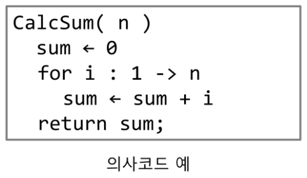
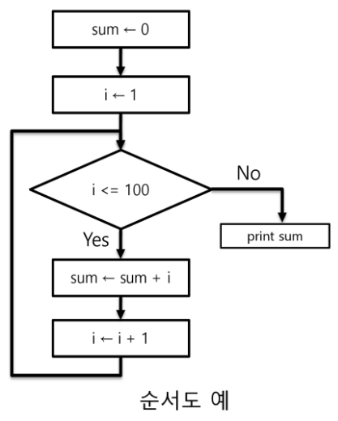
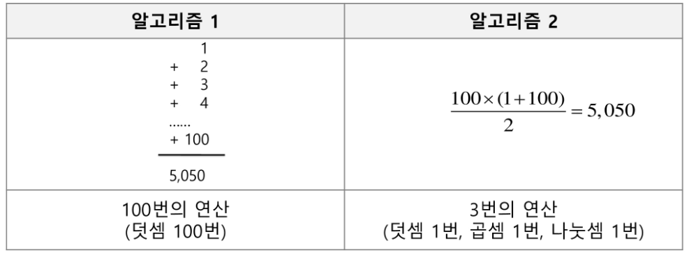
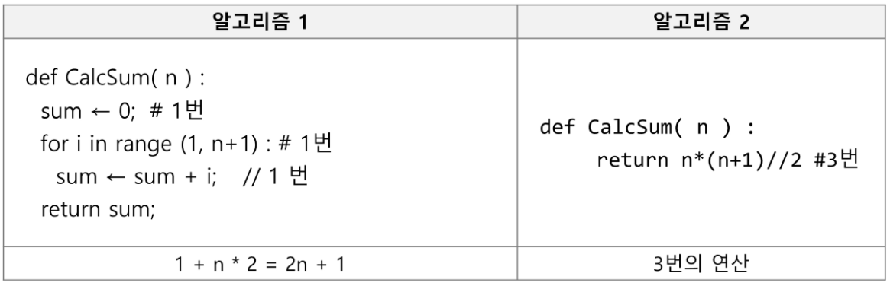
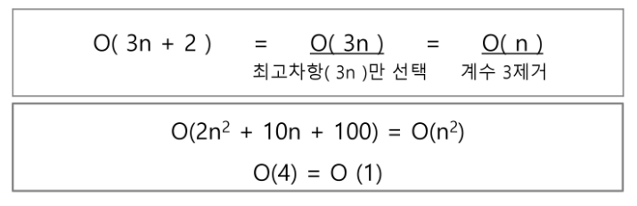
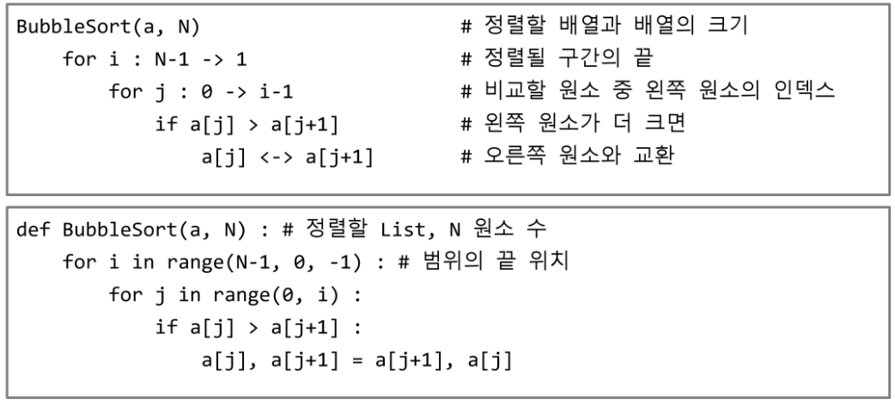

# 20230201

*내장함수 쓰지 않기.

## 알고리즘

- (명)알고리즘: 유한한 단계를 통해 문제를 해결하기 위한 **절차나 방법**. 주로 컴퓨터 용어로 쓰이며, 컴퓨터가 어떤 일을 수행하기 위한 단계적 방법을 말함.

- 어떠한 문제를 해결하기 위한 절차.

- 컴퓨터 분야에서 알고리즘을 표현하는 방법은 크게 두 가지
  
  - 의사코드(슈도코드, Pseudocode)와 순서도
  
  
  
  

- APS 과정의 목표 중의 하나는 **보다 좋은 알고리즘을 이해하고 활용**하는 것이다.

- 무엇이 좋은 알고리즘인가?
  
  - 1. **정확성**:얼마나 정확하게 동작하는가
    
    2. 작업량:얼마나 적은 연산으로 원하는 결과를 얻어내는가
    
    3. 메모리 사용량: 얼마나 적은 메모리를 사용하는가
    
    4. 단순성: 얼마나 단순한가
    
    5. 최적성: 더 이상 개선할 여지없이 최적화 되었는가.

- ex)1~100까지의 합

- 

- 알고리즘의 작업량을 표현 할 때 시간복잡도로 표현

- 시간 복잡도(Time Complexity)
  
  - 실제 걸리는 시간을 측정
  
  - 실행되는 명령문의 개수를 계산

- 

- 시간 복잡도 . 빅-오(O)표기법
  
  - 빅-오 표기법( Big-oh Notation)
  
  - 시간 복잡도 함수 중에서 가장 큰 영향력을 주는 n에 대한 항만을 표시
  
  - 계수(Coefficient)는 생략하여 표시

- 

- n개의 데이터를 입력받아 저장한 후 각 데이터에 1씩 증가시킨 후 각 데이터를 화면에 출력하는 알고리즘의 시간복잡도는 어떻게 되나? - O(n)

- 

## 배열1(Array 1)

> #### 배열이란?

- 일정한 자료형의 변수들을 하나의 이름으로 열거하여 사용하는 자료구조

- 아래의 예는 6개의 변수를 사용해야하는 경우, 이를 배열로 바꾸어 사용하는 것.

- ```python
  Num0 = 0; Num1 = 1; --- Num5 = 5;
                  ↓
  Num = [0, 1, 2, 3, 4 ,5]
  ```

> #### 배열의 필요성

- 프로그램 내에서 여러 개의 변수가 필요할 때, 일일이 다른 변수명을 이용하여 자료에 접근하는 것은 매우 **비효율적**일 수 있다.

- 배열을 사용하면 하나의 선언을 통해서 둘 이상의 변수를 선언할 수 있다.

- 단순히 다수의 변수 선언을 의미하는 것이 아니라, 다수의 변수로는 하기 힘든 작업을 배열을 활용해 쉽게 할 수 있다.

> #### 1차원 배열의 선언

- 별도의 선언 방법이 없으면 변수에 처음 값을 할당할 때 생성

- 이름: 프로그램에서 사용할 배열의 이름

```python
#1차원 배열 선언의 예
Arr = list() Arr = []
Arr = [1, 2, 3] Arr = [0] * 10
#1차원 배열의 접근
Arr[0] = 10 #'배열 Arr의 0번 원소에 10 저장'
Arr[idx] = 20 #'배열Arr의idx원소에20저장''
```

```python
배열 활용 예제: Gravity
# 상자들이 쌓여있는 방.
input = 7 4 2 0 0 6 0 7 0
box = list(map(int, input.split()))

#최댓값 찾기

box(i)의 오른쪽, box[i+1]~box[n-1]

#box의 각 원소
#box[i]보다 작은 숫자

append도 최대한 쓰지말고, 미리 배열크기 정해놓
100까지가 필요하다면
ans=[0]*100
```

## 정렬

- 2개 이상의 자료를 특정 기준에 의해 작은 값부터 큰 값(오름차순 : ascending), 혹은 그 반대의 순서대로(내림차순 : descending) 재배열하는 것

- 키
  
  - 자료를 정렬하는 기준이 되는 특정 값

- 대표적인 정렬 방식의 종류
  
  - 버블 정렬
  
  - 카운팅 정렬
  
  - 선택 정렬
  
  - 퀵 정렬
  
  - 삽입 정렬
  
  - 병합 정렬

- APS과정에 자료구조, 알고리즘 학습. 다양한 형태의 정렬을 학습

> #### 버블 정렬

- 인접한 두 개의 원소를 비교하며 자리를 계속 교환하는 방식

- 정렬 과정
  
  - 첫 번째 원소부터 인접한 원소끼리 계속 자리를 교환하면서 맨 마지막자리까지 이동한다.
  
  - 한 단계가 끝나면 가장 큰 원소가 마지막 자리로 정렬된다.
  
  - 교환하며 자리를 이동하는 모습이 물 위에 올라오는 거품 모양과 같다고 하여 버블 정렬이라고 한다.

- 시간 복잡도
  
  - O(n^2)

- [55, 7, 78, 12, 42]를 버블 정렬하는 과정(오름차순)
  
  1. 55 7 78 12 42
  
  2. 7 55 78 12 42
  
  3. 7 55 12 78 42
  
  4. 7 55 12 42 78  . . . . . . .

```python
```
55 7 78 12 42
for i : N-1 -> 1 # 각 구간의 끝
    for j : 0 -> i-1 # 비교할 왼쪽 원소
        if arr[j] > arr[j+1]
            arr[j] <-> arr[j+1] # 큰원소 오른쪽으로
        
```
N = int(input())
arr = list(map(int, input().split()))
for i in range(N-1, 0, -1): # 각 구간의 끝
    for j in range(i): # 비교할 왼쪽 원소
        if arr[j] > arr[j + 1]:
            arr[j], arr[j + 1] = arr[j+1], arr[j]
    
```


```python
3
5
55 7 78 12 42
6
55 7 78 100 42 1
7
55 7 78 12 42 2 90
가장 큰 값을 출

T = int(input())
for tc in range(1, T+1):
    N = int(input())
    arr = list(map(int, input().split()))
    maxV = arr[0] # 첫 원소를 최대로 가정
    for i in range(1, N): 나머지 원소와 비교
        if maxV = arr[i]:
            maxV = arr[i]
    print(f'#{tc} {maxV}')


```


```python
# 버블배열
import sys
# open 함수의 인자로 들어가는
# 문자열은 내가 열고자 하는 파일의 '경로'와 이름입니다.
sys.stdin = open('./input.txt')

# T = int(input())
# for tc in range(T):
#     N = int(input())
#     arr = list(map(int, input().split()))
#     for i in range(N-1, 0, -1):
#         for j in range(i):
#             if arr[j] > arr[j+1]:
#                 arr[j], arr[j+1] = arr[j+1], arr[j]
#     print(*arr)
```

```python
#max값 구하기
import sys
# open 함수의 인자로 들어가는
# 문자열은 내가 열고자 하는 파일의 '경로'와 이름입니다.
sys.stdin = open('./input.txt')
# T = int(input())
# for tc in range(1, T+1):
#     N = int(input())
#     arr = list(map(int, input().split()))
#     maxV = arr[0] # 첫 원소를 최대로 가정
#     for i in range(1, N): # 나머지 원소와 비교
#         if maxV < arr[i]:
#             maxV = arr[i]
#     print(f'#{tc} {maxV}')
```

```python
T = int(input())
for tc in range(1, T+1):
    N = int(input())
    arr = list(map(int, input().split()))
    minV = arr[0] # 첫 원소를 최소로 가정
    for i in range(1, N): # 나머지 원소와 비교
        if minV > arr[i]:
            minV = arr[i]
    print(f'#{tc} {minV}')
```

- 배열을 활용한 버블 정렬

- 앞서 살펴 본 정렬 과정을 코드로 구현하면 아래와 같다. (오름차순)



> #### 카운팅 정렬(Counting Sort)

- 항복들의 순서를 결정하기 위해 집합에 각 항목이 몇 개씩 있는지 세는 작업을 하여, 선형 시간에 정렬하는 효율적인 알고리즘

- 제한 사항

- 

- 

- 시간 복잡도

- O(n + k) : n은 리스트 길이, k는 정수의 최대값
  
  ```python
  
  ```
