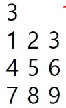
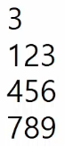

# 20230206

## 배열 2(Array 2)

#### 2차원 배열

#### 2차원 배열의 선언

- 1차원 List를 묶어놓은 List

- 2차원 이상의 다차원 List는 차원에 따라 Index를 선언

- 2차원 List의 선언: 세로길이(행의 개수), 가로길이(열의 개수)를 필요로 함

- Python에서는 데이터 초기화를 통해 변수선언과 초기화가 가능함

- arr = [[0, 1, 2, 3][4, 5, 6, 7]] (2행 4열의 2차원 List)

| 0   | 1   | 2   | 3   |
| --- | --- | --- | --- |
| 4   | 5   | 6   | 7   |



```python
N = int(input)
arr = [list(map(int, input().split()))for _ in range(N)]
```



```python
N = int(input)
arr = [list(map(int, input())) for _ in range(N)]
# 공백이 없으면 split 안해도 된다.
```

#### 2차원 배열의 접근

- 배열 순회
  
  - n x m 배열의 n*m 개의 모든 원소를 빠짐없이 조사하는 방법
    각 우선 순회가 필요하면 바로 나올 수 있을 정도로 연습.

- 행 우선 순회 (우리가 알고있는 단순한 이중포문)
  00 01 02 03 >>>>
  10 11 12 13 >>>>
  20 21 22 23 >>>>
  
  ```python
  # i 행의 좌표
  # j 열의 좌표
  for i in range(n):
      for j in range(m):
          Array[i][j] # 필요한 연산 수행
  ```

- 열 우선 순회
  ↓↓↓↓
  
  ```python
  #i : 행의 좌표
  #j : 열의 좌표
  for j in range(m):
      for i in range(n):
          Array[i][j] # 필요한 연산 수행
  ```

- 지그재그 순회(계산을 해보니 이런 모양이면 되더라)
  
  .>>>
  
  .<<<
  
  .>>>
  
  ```python
  # i 
  # j
  for i in range(n):
  for j in range(m):
    Array[i][j + (m-1-2*j) * (i%2)] # 필요한 연산 수행
                 홀수일때, i가짝수일때, 방향을 전환해보자.
              j가 1일때, m이 3이고 
              뭐 if 문으로 해도 됨.
  ```

이제 그냥 순회하는 것이 아니라, 조건을 붙여서 순회해보자.

- 델타를 이용한 2차 배열 탐색
  
  - 2차배열의 한 좌표에서 4방향의 인접 배열 요소를 탐색하는 방법
    
                       8방향 짜리도 만들수 있다.

```python
arr[0...N-1][0...N-1] # N x N 배열
di[] ← [0, 0, -1, 1]
dj[] ← [-1, 1, 0, 0] # 좌우 상하
for i : 0 -> N-1
  for j : 0 -> N-1
    for k in range(4) :
      ni ← i + di[k]
      nj ← j + dj[k]
      if 0 <= ni<N and 0 <= nj < N #유효한 인덱스면
                test(arr[ni][nj])
```

```python
di = [0, 1, 0, -1] 
dj = [1, 0, -1, 0] # 우 하 좌 상
N = 3
for i in range(N):
    for j in range(N):
        for k in range(4):
            ni, nj = i+di[k], j+dj[k]
            print(i, j, ni, nj)
```

```python
di = [0, 1, 0, -1] 
dj = [1, 0, -1, 0] # 우 하 좌 상
N = 3
for i in range(N):
    for j in range(N):
        for k in range(4):
            ni, nj = i+di[k], j+dj[k]
            if 0 <= ni < N and 0<=nj<N:
                print(i, j, ni, nj)
```

```python
di = [0, 1, 0, -1] 
dj = [1, 0, -1, 0]
N = 3
for i in range(N):
    for j in range(N):
        for di, dj in [[0, 1], [1,0],[0,-1],[-1,0]]:
            ni, nj = i+di, j+dj
            if 0<=ni<N and 0<=nj<N:
                print(i,j,ni,nj)
```

- 전치 행렬 # 뒤집는거
  
  ```python
  # i: 행의 좌표, len(arr)
  # j: 열의 좌표, len(arr[0])
  arr = [] # 3*3 행렬
  
  for i in range(3):
      for j in range(3) :
          if i < j :
              arr[i][j], arr[j][i] = arr[j][i], arr[i][j]                       
  arr = [[1. 2.]]
  ```
  
  내가 구하고자 하는 값이 어디서 초기화 되어야 하는가.

<연습문제>

#### 부분집합 합(Subset Sum) 문제

- 유한 개의 정수로 이루어진 집합이 있을 때, 이 집합의 부분집합 중에서 그 집합의 원소를 모두 더한 값이 0이 되는 경우가 있는지를 알아내는 문제

- 예를 들어, [-7, -3, -2, 5, 8]라는 집합이 있을 때, [-3, -2, 5]는 이 집합의 부분집합이면서 (-3) + (-2) + 5 = 0이므로 이 경우는 답은 참이 된다.
  
  #### 부분집합 생성하기

- 완전검색 기법으로 부분집합 합 문제를 풀기위해서는, 우선 집합의 "모든 부분집합을 생성"한 후에 각 부분집합의 합을 계산해야 한다.

- 주어진 집합의 부분집합을 생성하는 방법에 대해서 생각해보자.
  
  ##### 부분집합의 수

- 집합의 원소가 n개 일 때, 공집합을 포함한 부분집합의 개수는 2^n개 이다.
  ex) (1 2 3)의 부분집합 = 공집합, 1, 2, 3, (1 2), (1 3), (2 3), (1 2 3) = 8개/ 이진수라 0 0 0, 0 0 1, 0 1 0 등 2의 제곱으로 가능?

- 이는 각 원소를 부분집합에 포함시키거나 포함시키지 않는 2가지 경우를 모든 원소에 적용한 경우의 수와 같다.

- 예) {1, 2, 3, 4}  → 2 * 2 * 2* 2 = 16가지

- 각 원소가 부분집합에 포함되었는지를 loop 이용하여 확인하고, 부분집합을 생성하는 방법
  
  ```python
  bit = [0, 0, 0, 0] #원소가 4개니까
  for i in range(2) :
    bit[0] = i
    for j in range(2):
        bit[1] = j
        for k in range(2):
            bit[2] = k
            for l in range(2):
                bit[3] = l
                print_subset(bit)
  ```

```
```python
A = [1,2,3,4]
bit = [0] * 4
for i
    bit[]
    for j
        bit
        for l
            bit
            print90
            for p in range(4)
                if bit[p]:
                    print()
                    s += A[p], ' '
                print()
```