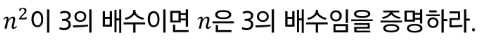

# 20230302

## Computational Thinking

#### 논리와 증명

- 역 이 대우 표. 이건 외워두면 ㄱㅊㄱㅊ

문제 12 : n^2이 3의 배수이면 n은 3의 배수임을 증명하라

- 대우와 명제는 같은 진리값을 가진다.
  역 : n이 3의 배수면 n의 제곱은 3의 배수다
  이 : n제곱이 3의 배수가 아니면, n은 3의 배수가 아니다
  대우 : n은 3의배수가 아니면, n제곱은 3의 배수가 아니다.

역/이는 뭐 참거짓 증명하는데 큰 도움은 안되고,

수학적 귀납법
대우. n= 1 >> 3의 배수가 아님 / 1제곱 = 3의배수가 아님
     n+1 >> 2는 3의 배수가 아님/ 

    n = 3k + r(1또는 2) / 
    n+1 = (3k+1)^제곱 => 9k^2 + 6k + 1 => 3(3k^2+2k) + 1 

문제 8 : T(n) = T(n-1) + 1/n T(1) = 1 
big(o) 계산?
기초수식

#### 문제 12

*대우와 명제는 같은 진리값을 가진다.

- 대우 : n은 3의배수가 아니면, n²은 3의 배수가 아니다.

$$
n = 3k + r

$$

                                                                    r은 1 또는 2

                         r이 1일 때 참

$$
n^2= (3k+1)^2 => 9k^2 + 6k + 1 => 3(3k^2+2k) + 1               
$$

                    r이 2일 때 참

$$
n^2= (3k+2)^2 => 9k^2 + 12k + 4 => 3(3k^2+4k+1) + 1 
$$

                                                    대우가 참이므로 명제도 참이다.
