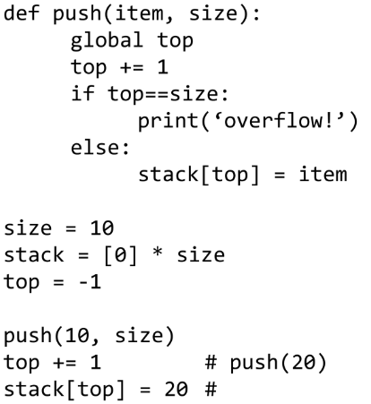
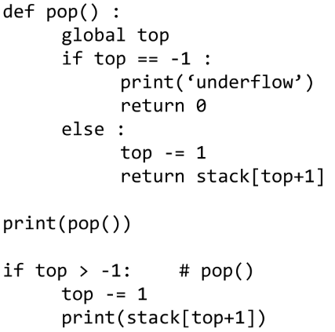

# 20230213

## 스택1

- 스택(stack)의 특성
  - 물건을 쌓아 올리듯 자료를 쌓아 올린 형태의 자료구조이다.
  - 스택에 저장된 자료는 선형 구조를 갖는다.
  - 선형구조: 자료 간의 관계가 1대1의 관계를 갖는다.
  - 비선형구조: 자료 간의 관계가 1대N의 관계를 갖는다.(예: 트리)
  - 스택에 자료를 삽입하거나 스택에서 자료를 꺼낼 수 있다.
  - 마지막에 삽입한 자료를 가장 먼저 꺼낸다. 후입선출(LIFO, Last-In-First-Out)이라고 부른다.
  - 예를 들어 스택에 1,2,3 순으로 자료를 삽입한 후 꺼내면 역순으로 즉 3, 2, 1 순으로 꺼낼 수 있다.

*스택을 프로그램에서 구현하기 위해서 필요한 자료구조와 연산

#### 자료구조

    자료를 선형으로 저장할 저장소
    - 배열을 사용할 수 있다.
    - 저장소 자체를 스택이라 부르기도 한다.
    - 스택에서 마지막 삽입된 원소의 위치를 top이라 부른다.

#### 연산

- 삽입: 저장소에 자료를 저장한다. 보통push라고 부른다.

- 삭제: 저장소에서 자료를 꺼낸다. 꺼낸 자료는 삽입한 자료의 역순으로 꺼낸다. 보통 pop이라고 부른다.

- 스택이 공백인지 아닌지를 확인하는 연산. isEmpty

- 스택의 top에 있는 item(원소)을 반환하는 연산. peek

- 스택의 push 알고리즘
  
  - append 메소드를 통해 리스트의 마지막에 데이터를 삽입
    
    ```python
    def push(item) :
    s.append(item) # 단점: 느림..
    ```
    
    참고
    
    

-----------------

- 스택의 pop 알고리즘
  
  ```python
  def pop() :
    if len(s) == 0:
        # underflow
        return
    else :
        return s.pop();
  ```
  
  참고
  
  

<연습문제1>
스택 구현
구현한 스택을 이용하여 3개의 데이터를 스택에 저장하고 
다시 3번 꺼내서 출력

```python
stack = [0] * 3
top = -1

top += 1 #push(10)
stack[top] = 10
top += 1 #push(20)
stack[top] = 20
top += 1 #push(30)
stack[top] = 30

top -= 1
print(stack[top+1])
top -= 1
print(stack[top+1])
top -= 1
print(stack[top+1])
```

#### 스택구현 고려사항

- 1차원 배열을 사용하여 구현할 경우 구현이 용이하다는 장점이 있지만 스택의 크기를 변경하기가 어렵다는 단점이 있다.
- 이를 해결하기 위한 방법으로 저장소를 동적으로 할당하여 스택을 구현하는 방법이 있다. 동적 연결리스트를 이용하여 구현하는 방법을 의미한다. 구현이 복잡하다는 단점이 있지만 메모리를 효율적으로 사용한다는 장점을 가진다. 스택의 동적 구현은 생략한다.

## 스택의 응용1 : 괄호 검사

- 괄호의 종류: 대괄호('[',']'), 중괄호, 소괄호

- 조건
  
  - 왼쪽 괄호의 개수와 오른쪽 괄호의 개수가 같아야 한다.
  - 같은 괄호에서 왼쪽 괄호는 오른쪽 괄호보다 먼저 나와야 한다.
  - 괄호 사이에는 포함 관계만 존재한다

- 오류
  
  - 괄호 수식이 끝났는데 스택에 괄호가 남아 있음

더이상 괄호가 없고 스택도 비었음. ← 정상
더이상 괄호가 없고 스택에 괄호가 있음 ← 오류
닫는 괄호가 있는데 스택이 비어있음 ← 오류

- 괄호를 조사하는 알고리즘 개요
  - 문자열에 있는 괄호를 차례대로 조사하면서 왼쪽 괄호를 만나면 스택에 삽입하고, 오른쪽 괄호를 만나면 스택에서 top 괄호를 삭제한 후 오른쪽 괄호와 짝이 맞는지를 검사한다.
  - 이 때, 스택이 비어 있으면 조건 1 또는 조건 2에 위배되고 괄호의 짝이 맞지 않으면 조건 3에 위배된다.
  - 마지막 괄호까지를 조사한 후에도 스택에 괄호가 남아 있으면 조건 1에 위배된다.

<연습문제 2>

## 스택의 응용2 : function call

- Function call
  - 프로그램에서의 함수 호출과 복귀에 따른 수행 순서를 관리
  - 가장 마지막에 호출된