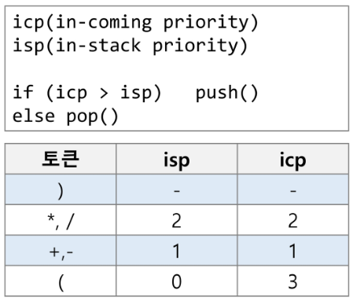

# 20230215

## 스택2

> 계산기 1

- 문자열로 된 계산식이 주어질 때, 스택을 이용하여 이 계산식의 값을 계산할 수 있다.

- 문자열 수식 계산의 일반적 방법
  
  - step1. 중위 표기법의 수식을 후위 표기법으로 변경한다.(스택 이용)
  
  - step2. 후위 표기법의 수식을 스택을 이용하여 계산한다.
    
    - 중위표기법(infix notation)
      
      - 연산자를 피연산자의 가운데 표기하는 방법
        
        예) A + B
    
    - 후위표기법(postfix notation)
      
      - 연산자를 피연산자 뒤에 표기하는 방법
        
        예) AB+

- step1. 중위표기식의 후위표기식 변환 방법1
  
  - 수식의 각 연산자에 대해서 우선순위에 따라 괄호를 사용하여 다시 표현한다.
  
  - 각 연산자를 그에 대응하는 오른쪽괄호의 뒤로 이동시킨다.
  
  - 괄호를 제거한다.
    
     예) A*B-C/D
    
     1단계 : ( (A*B) - (C/D) )

          2단계 : ( (A B)* (C D)/ )-

          3단계 : AB*CD/-

- step1. 중위 표기법에서 후위 표기법으로의 변환 알고리즘(스택 이용)2
  
  1)입력 받은 중위 표기식에서 토큰을 읽는다.
  
  2)토큰이 피연산자이면 토큰을 출력한다
  
  3)토큰이 연산자(괄호포함)일 때, 이 토큰이 스택의 top에 저장되어 있는 연산자보다 우선순위가 높으면 스택에 push하고, 그렇지 않다면 스택 top의 연산자의 우선순위가 토큰의 우선순위보다 작을 때까지 스택에서 pop 한 후 토큰의 연산자를 push한다. 만약 top에 연산자가 없으면 push한다.
  
  4)
  
  5)
  
  6)
  
  

- 우선순위 존재. 토큰하나 가져와. 스택 비어있으면 넣어. 스택 안에 뭐 있으면 토큰이 연산자면 스택 top과 비교. 높으면 push, 여는괄호 push.
  
  피연산자(숫자)면 따로 킵해둬
  
  여는 괄호는 스택안에 들어오면 우선순위가 젤 낮은데, 밖에있을땐 젤 높아용

        숫자 높을 수록 우선순위 높다

계산기 2

- step2. 후위 표기법의 수식을 스택을 이용하여 계산
  
  1)
  
  2)
  
  3)

## 백트래킹

- 해를 찾는 도중에 막히면 되돌아가서 다시 해를 찾는 기법

- 최적화 문제와 결정문제를 해결

- 결정문제 : yes or no
  
  - 미로찾기 : [0, 0, 1]
    
                      [1, 0, 1]
    
                      [1, 0, 0]  #0부분이 통로
    
                        (0, 0 오른쪽)  #지나갈때마다 비지티드를 만들어
    
                        (0, 1 아래쪽)

- 백트래킹과 깊이우선탐색과의 차이

- 깊이우선탐색은 기본적으로 모든 칸을 방문.

- 백트래킹은 불필요한 경로를 조기에 차단. (유망하지 않다고 결정되면 가지치기.)
  일반 백트래킹 알고리즘
  
  ```python
  def checknode(v) : # node
    if promising(v):
        if there is a solution at v:
            write the solution
        else:
            for u in each child of v:
                checknode(u)
  ```

--------------------------

상태 공간 트리

#### 부분집합 구하기

백트래킹을 이용해서.
지금 하는건 형식적인거. 내일할건 좀 쉬운거.

- 백트래킹 기법으로 powerset

좀 단순한거 부분집합

```python
def f(i, k):
    if i == k:
        print(bit)  
    else:
        bit[i] = 1
        f(i+1, k)
        bit[i] = 0
        f(i+1, k)

A = {1, 2, 3}
N = len(A)
bit = [0] * N
f(0, N)
```
