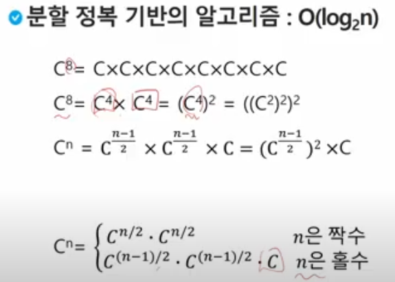

# 20230216

#### 부분집합 구하기

#### 분할정복 알고리즘

- 유래
  - 1805년 12월 2일 아우스터리츠 전투에서 나폴레옹이 사용한 전략
  - 전력이 우세한 연합군을 공격하기 위해 나폴레옹은 연합군의 중앙부로 쳐들어가 연합군을 둘로 나눔
  - 둘로 나뉜 연합군을 한부분씩 격파
- 설계전략
  - 분할
  - 정복
  - 통합

#### 분할정복 예제

- 

#### 퀵정렬
- 주어진 배열을 두개로 분할하고, 각각을 정렬한다.
 - 합병정렬과 동일?
- 다른점1 : 합병정렬은 그냥 두 부분으로 나누는 반면에, 퀵정렬은 분할할 때, 기준 아이템(pivot item) 중심으로, 이보다 작은 것은 왼편, 큰것은 오른편에 위치시킨다.
- 다른점2 : 합병정렬은 '합병'이란 후 처리 작업이 필요하나, 퀵정렬은 필요로 하지 않는다.

