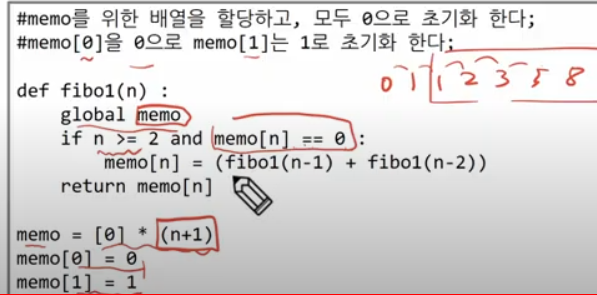
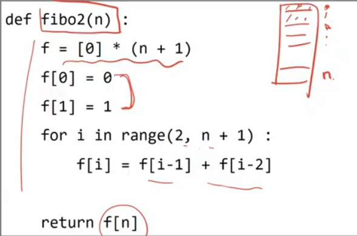

# 20230214

#### function call

하던거 마저.

## 재귀호출

- stack overflow<< 파이썬에서 정한 재귀 횟수를 초과?

- 자기 자신을 호출하여 순환 수행되는 것 (아 서로 다른 함수가 호출되는 과정하고 똑같아요, 어차피 그냥 내부가 똑같이 생겼기때문에 따로따로 만들지않고 똑같이 생긴애를 부르는데 어차피 메모리영역의 구분이 되니까 서로 다른 함수를 부르는거랑 똑같겠구나 생각하세용  )

- 함수에서 실행해야 하는 작업의 특성에 따라 일반적인 호출방식보다 재귀호출방식을 사용하여 함수를 만들면 프로그램의 크기를 줄이고 간단하게 작성
  
  - 재귀 호출의 예) factorial
  - n에 대한 factorial : 1부터 n까지의 모든 자연수를 곱하여 구하는 연산
      n! = n x (n-1)!
  - 
  - factorial 함수에서 n=4인 경우의 실행
  
  피보나치
  
  - 0과 1로 시작하고 이전 두 수 합을 다음 항으로 하는 수열을 피보나치라 한다
  - 0,1,1,2,3,5,8,13,...
  - 피보나치 수열의 i번 째 값을 계산하는 함수 F를 정의 하면 다음과 같다.
  - ```python
    def fibo(n):
      if n < 2:
          return n
      else :
          return fibo(n-1) + fibo(n-2)
    ```
  
  근데 잘 안쓴대 재귀로 피보나치. 엄청난 중복호출 때문에 
  그래서
  
  #### Memoization

- 메모이제이션(memoization)은 이전에 계산한 값을 메모리에 저장해서 매번 계산을 하지않도록 하여 전체 실행속도를 빠르게하는 기술 (동적 계획법의 핵심 기술)

- 앞의 예에서 피보나치 수를 구하는 알고리즘에서 fibo(n)의 값을 계산하자마자 저장하면, 실행시간을 Θn으로 줄일 수 있다.



탑 다운

## DP(Dynamic Programming)

- 동적 계획(DP) 알고리즘은 그리디 알고리즘과 같이 최적화 문제를 해결하는 알고리즘

- 동적 계획 알고리즘은 먼저 입력 크기가 작은 부분 문제들을 모두 해결한 후에 그 해들을 이용해 보다 큰 크기의 부분문제들을 해결하여 최종적으로 원래 주어진 입력의 문제를 해결하는 알고리즘

- 피보나치 수 DP 적용
  
  - 피보나치 수는 부분 문제의 답으로부터 본 문제의 답을 얻을 수 있으므로 최적 부분 구조로 이루어져 있다.
  
  1)
  2)
  3)

- 피보나치 수 DP 적용 알고리즘
  
  
  
  바텀업

- DP의 구현 방식
  
  - recursive 방식 : fib1() #교수님은 과감하게 메모이제이션이라고 퉁치고
  
  - iterative 방식 : fib2() #이건 DP라고
  
  - memoization을 재귀적 구조에 사용하는 것 보다 반복적 구조로 DP를 구현한것이 성능면에서 보다 효율적이다.
  
  - 재귀적구조는 내부에 시스템 호출 스택을 사용하는 오버헤드가 발생하기 때문이다.(함수호출복귀 시간이 좀 걸리는 문제가 생긴다)

## DFS(깊이우선탐색)

- 비선형구조인 그래프 구조는 그래프로 표현된 모든 자료를 빠짐없이 검색하는 것이 중요함
- [[1, 2], [2, 1]] # 1에서 2 갈수있고 2에서 1 갈수있고 뭐 그런걸 담은?
- 각각의 요소들의 관계의 정보를 리스트에 담아낼 수 있다. 근데 이렇게말고
- [0,0,0,0,0][0,0,1,1,0]
-  
- 두가지 방법
  - 깊이 우선 탐색(Depth First Search, DFS)
  - 너비 우선 탐색(Breadth First Search, BFS)
- 시작 정점의 한 방향으로 갈 수 있는 경로가 있는 곳까지 깊이 탐색해 가다가 더 이상 갈 곳이 없게 되면, 가장 마지막에 만났던 갈림길 간선이 있는 정점으로 되돌아와서 다른 방향의 정점으로 탐색을 계속 반복하여 결국 모든 정점을 방문하는 순회방법
- 가장 마지막에 만났던 갈림길의 정점으로 되돌아가서 다시 깊이 우선 탐색을 반복해야 하므로 후입선출 구조의 **스택** 사용
- 1. 시작 정점 v를 결정하여 방문한다
- 2. 정점v에 인접한 정점 중에서
  - 1)방문하지 않은 정점 w가 있으면, 정점v를 스택에 push 하고 정점 w를 방문한다. 그리고 w를 v로 하여 다시 2를 반복한다.
  - 2)방문하지 않은 정점이 없으면, 탐색의 방향을 바꾸기 위해서 스택을 pop하여 받은 가장 마지막 방문 정점을 v로하여 다시2)를 반복한다.
- 3. 스택이 공백이 될 때까지 2)를 반복한다.


노드 = A,B,C,D,E,F,G 와같은 요소?

노드와 노드 사이의 선, 간선.