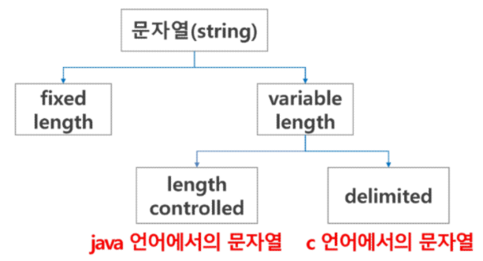

# 20230208

## 문자열

> #### 문자의 표현

컴퓨터에서의 문자표현

- 글자 A를 메모리에 저장하는 방법에 대해서 생각해보자

- 메모리는 숫자만을 저장할 수 있기에, A라는 글자의 모양 그대로 비트맵으로 저장하는 방법(메모리 낭비 심함)을 쓰지 않는 한, 각 문자에 대응되는 숫자를 정해놓고 이것을 메모리에 저장

- 영어가 대소문자 합쳐서 52이므로 6(64가지)비트면 모두 표현할 수 있다. 이를 코드 체게라고 한다.
  
  - -000000 -> 'a', 000001 -> 'b'

- 그런데 네트워크가 발전되기 전 미국의 각 지역 별로 코드 체계를 정해놓고 사용했지만, 네트워크(인터넷)이 발전하면서 서로간에 정보를 주고받을때 정보를 달리 해석한다는 문제가 발생

- 그래서 혼돈을 피하기 위해 표준안을 만들기로함

- 바로 이러한 목적으로 1967년, 미국에서 ASCII(American Standard Code for Information Interchange) 라는 문자 인코딩 표준이 제정

- ASCII는 7bit 인코딩으로 128문자를 표현하며 33개의 출력 불가능한제어 문자들과 공백을 비롯한 95개의 출력 가능한 문자들로 이루어져있다.

- 출력가능 아스키 문자(32~126)

- 확장 아스키는 표준 문자 이외의 악센트 문자, 도형 문자, 특수 문자, 특수기호 등 부가적인 문자를 128개 **추가**할 수 있게 하는 부호이다.
  
  - 표준 아스키는 7bit를 사용하여 문자를 표현하는 데 비해 확장 아스키는 1B 내의 8bit를 모두 사용함으로써 추가적인 문자를 표현할 수 있다.
  
  - 컴퓨터생산자와
  
  - 그러므로 표준 아스키는 마이크로컴퓨터 하드웨어 및 소프트웨어 사이에서 세계적으로 통용되는 데 비해, 확장 아스키는 프로그램이나 컴퓨터 또는 프린터가 그것을 해독할 수 있도록 설계되어 있어야만 올바로 해독될 수 있다.

- 확장 아스키 예

- 오늘날 대부분의 컴퓨터는 문자를 읽고 쓰는데 ASCII형식을 사용한다.

- 그런데 컴퓨터가 발전하면서 미국 뿐 아니라 각 나라에서도 컴퓨터가 발전했으며 각 국가들은 자국의 문자를 표현하기 위하여 코드 체계를 만들어서 사용하게 되었다.
  
  - 우리나라도 아주 오래된 이야기지만 한글 코드체계를 만들어 사용했고 조합형, 완성형 두 종류를 가지고 있었다.

- 인터넷이 전 세계로 발전하면서 ASCII를 만들었을 때의 문제와 같은 문제가 국가간에 정보를 주고 받을 때 발생했다.

- 자국의 코드체계를 타 국가가 가지고 있지 않으면 정보를 잘못 해석 할 수 밖에 없었다.

- 그래서 다국어 처리를 위해 표준을 마력했다 이를 유니코드라고 한다.

- 유니코드 이미지

- 유니코드도 다시 Character Set으로 분류된다.
  
  - UCS-2(Universal Character Set 2)
  
  - UCS-4(Universal Character Set 4)
  
  - 유니코드를 저장하는 변수의 크기를 정의 
  
  - 그러나, 바이트 순서에 대해서 표준화하지 못했음 
  
  - 다시 말해 파일을 인식 시 이 파일이 UCS-2, UCS-4인지 인식하고 각 경우를 구분해서 모두 다르게 구현해야 하는 문제 발생 
  
  - 그래서 유니 코드의 적당한 외부 인코딩이 필요하게 되었다.

- 유니코드 인코딩

- Python 인코딩
  
  - 2.x버전 - ASCII -> #-*- coding: utf-8 -**-(첫줄에 명시)
  
  - 3.x버전 - 유니코드 UTF-8 -> 생략 가능
  
  - 다른 인코딩 방식으로 처리 시 첫 줄에 작성하는 위 항목에 원하는 인코딩방식을 지정해주면 됨

> #### 문자열

- 문자열의 분류

- java에서 String 클래스에 대한 메모리 배치 예
  
  - 그림에서 보이듯, java.lang.String 클래스에는 기본적인 객체 메타 데이터 외에도

- C언어에서 문자열 처리
  
  - 문자열은 문자들의 배열 형태로 구현된 응용 자료형
  
  - 문자배열에 문자열을 저장할 때는 항상 마지막에 끝을 표시하는 널문자('\0')를 넣어줘야 한다.
    
    char ary[]={'a', 'b', 'c', '\0'}; // 또는 char ary[]="abc";
  
  - 문자열 처리에 필요한 연산을 함수 형태로 제공한다. 
    
    strlen(), strcpy(), strcmp(), ...

[참고]

- 다음 두 코드의 차이 이해하기
  
  - s1 = list(input())
  
  - s2 = input()

- strlen() 함수 만들어 보기
  
  - def strlen(a): #'\0'을 만나면 '\0'을 제외한 글자수를 리턴
    
    .# while을 써서 함수를 완성해보세요
    
    a = ['a', 'b', 'c', '\0']

              print(strlen(a))

[문자열]

- Java(객체지향 언어)에서의 문자열 처리
  
  - 문자열 데이터를 저장, 처리해주는 클래스를 제공한다
  
  - 
  
  - 
  
  - 

- Python에서의 문자열 처리
  
  - char 타입 없음
  
  - 텍스트 데이터의 취급방법이 통일되어 있음
  
  - 문자열 기호
    
    - -'(홑따옴표), "(쌍따옴표), '''(홑따옴표3개), """(쌍따3개) 
    
    - +연결(Concatenation)
      
      - 문자열 + 문자열: 이어 붙여주는 역할
    
    - *반복
      
      - 문자열*수: 수만큼 문자열이 반복
    
    - 문자열은 시퀀스 자료형으로 분류되고, 시퀀스 자료형에서 사용할 수 있는 인덱싱, 슬라이싱 연산들을 사용할 수 있음
    
    - 문자열 클래스에서 제공되는 메소드
      
      - replace(), split(), isalpha(), find()
    
    - 문자열은 튜플과 같이 요소값을 변경 할 수 없음(immutable)

- C와 Java의 S
