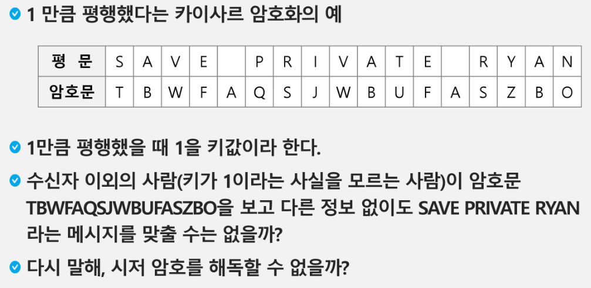

# 20230209

## 패턴 매칭

- 패턴 매칭에 사용되는 알고리즘들
  
  - 고지식한 패턴 검색 알고리즘
  
  - 카프-라빈 알고리즘
  
  - KMP 알고리즘
  
  - 보이어-무어 알고리즘

#### 고지식한 알고리즘(Brute Force)

- 본문 문자열을 처음부터 끝까지 차례대로 순회하면서 패턴 내의 문자들을 일일이 비교하는 방식으로 동작

- 코드:String_1.py

- 시간 복잡도: 최악의 경우 O(MN)이 됨
  
  - ex) 길이가 10000인 문자열. 길이 80인 패턴 찾을때, 최악의 경우 약 10000 x 80 = 800000번의 비교가 일어남

#### KMP 알고리즘

- 특정한 상황에 쓸 수 있음.
- 불일치가 발생한 텍스트 스트링의 앞 부분에 어떤 문자가 있는지를 미리 알고 있으므로, 불일치가 발생한 앞 부분에 대하여 다시 비교하지 않고 매칭을 수행

- 패턴을 전처리하여 배열 next[M]을 구해서 잘못된 시작을 최소화함
  
  - next[M]: 불일치가 발생했을 경우 이동할 다음 위치

- 시간 복잡도 : O(M+N)

? _ ? 코드 안함 ?_? 함

#### 보이어-무어 알고리즘

- 오른쪽에서 왼쪽으로 비교

- 대부분의 상용 소프트웨어에서 채택하고 있는 알고리즘

- 보이어-무어 알고리즘은 패턴에 오른쪽 끝에 있는 문자가 불일치하고 이 문자가 패턴 내에 존재하지 않는 경우, 이동 거리는 무려 패턴의 길이만큼이 된다.

- 문자열 매칭 알고리즘 비교
  
  - 찾고자 하는 문자열 패턴의 길이 m, 총 문자열 길이 n
  
  - 고지식한 패턴 검색 알고리즘: 수행시간O(mn)
  
  - 카프-라빈 알고리즘: 수행시간Θ(n)
  
  - KMP 알고리즘: 수행시간Θ(n) 
  
  - * O는 최악의 경우? Θ는 거의 고정?
  
  - 보이어-무어 알고리즘
    
    - 앞의 두 매칭 알고리즘들의 공통점 텍스트 문자열의 문자를 적어도 한번씩 훑는다는 것이다. 따라서 최선의 경우에도 Ω(n)
    
    - 보이어-무어 알고리즘은 텍스트 문자를 다 보지 않아도 된다
    
    - 발상의 전환: 패턴의 오른쪽부터 비교한다
    
    - 최악의 경우 수행시간 :Θ(mn)
    
    - 입력에 따라 다르지만 일반적으로 Θ(n)보다 시간이 덜 든다

##### [참고] 문자열 암호화

- 시저 암호(Caesar cipher)
  
  - 줄리어스 시저가 사용했다고 하는 암호이다.
  
  - 시저는 기원전 100년경에 로마에서 활약했던 장군이었다.
  
  - 시저 암호에서는 평문에서 사용되고 있는 알파벳을 일정한 문자 수 만큼 [평행이동] 시킴으로써 암호화를 행한다.
  
  - 
    
    - 시저 암호문에 대한 전사공격
    
    - 문자변환표를 이용한 암호화(단일 치환 암호)
      
      - 단순한 카이사르 암호화보다 훨씬 강력한 암호화 기법
    
    - 단일 치환 암호의 복호화
      
      - 복호화 하기 위해서는 모든 키의 조합(key space)가 필요하다.
      
      - 단일 치환 암호의 키의 총수는
        
        - 26 x 25 x 24 x 23 x ... x1 = 26! = 403291461126605635584000000
      
      - 1초에 10억개의 키를 적용하는 속도로 조사한다고 해도, 모든 키를 조사하는데 120억년 이상의 시간이 걸린다. 방법이 없을까? 있다. 관심있으면 찾아보길ㅋ
      
      - bit열의 암호화
        
        - 배타적 논리합(exclusive-or) 연산 사용
      
      - 다음과 같은 문자열이 있다. 저장소의 크기를 줄이며 정확한 정보를 저장하는 방법은?
        
        - Run-length encoding 알고리즘
        
        - 같은 값이 몇 번 반복되는가를 나타냄으로써 압축
        
        - 이 방법은 이미지 파일포맷 중 BMP 파일 포맷의 압축 방법이다.
        
        - 좀더 효율적이고 일반적인 압축방법은 없는가?
          
          - 허프만 코딩 알고리즘 등.

