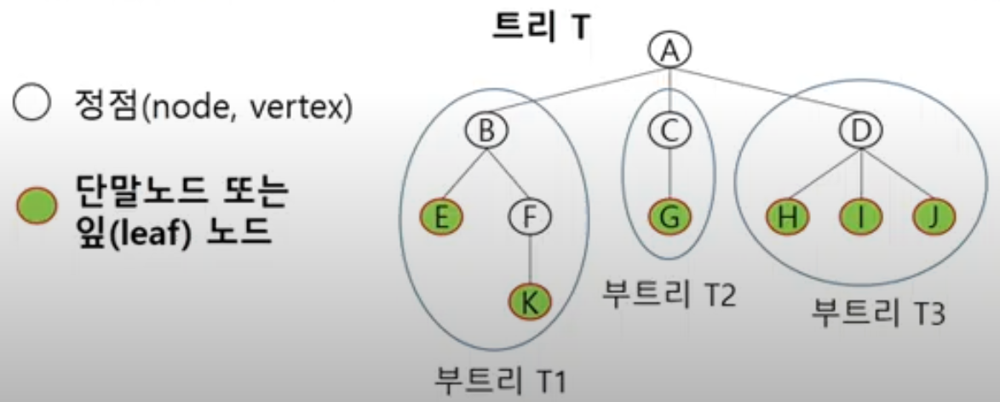
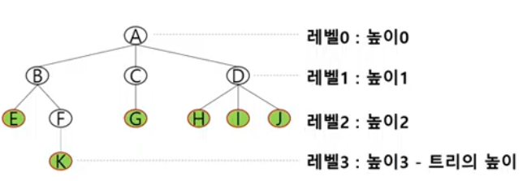
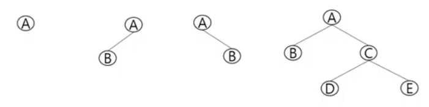
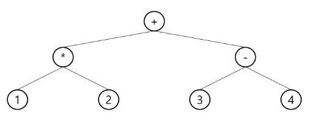
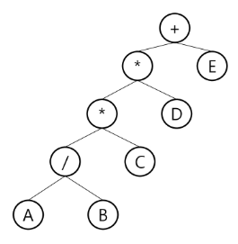

# 20230222

## 트리

- 트리의 개념
  - 비선형 구조
  - 원소들 간에 1:n 관계를 가지는 자료구조
  - 원소들 간에 계층관계를 가지는 계층형 자료구조
  - 상위 원소에서 하위 원소로 내려가면서 확자되는 트리(나무)모양의 구조

#### 트리 - 정의

- 한개 이상의 노드로 이루어진 유한 집합이며, 다음 조건을 만족한다.
  - 노드 중 최상위 노드를 루트(root)라 한다.
  - 나머지 노드들은 n(>=0)개의 분리 집합 T1,...,TN으로 분리될 수 있다.
- 이들 T1, ... , TN은 각각 하나의 트리가 되며(재귀적 정의) 루트의 부 트리(subtree)라 한다.

#### 트리 - 용어정리

- 노드(node) - 트리의 원소
  
  - 트리 T의 노드 - A,B,C,D,E,F,G,H,I,J,K

- 간선(edge)- 노드를 연결하는 선. 부모 노드와 자식 노드를 연결

- 루트 노드 (root node) - 트리의 시작 노드
  
  - 트리 T의 루트노드 - A
    
    

- 형제 노드(sibling node) - 같은 부모 노드의 자식 노드들

- 조상 노드 - 간선을 따라 루트 노드까지 이르는 경로에 있는 모든 노드들
  
  - K의 조상 노드 : F,B,A

- 서브 트리(subtree) - 부모 노드와 연결된 간선을 끊었을 때 생성되는 트리

- 자손 노드 - 서브 트리에 있는 하위 레벨의 노드들
  
  - B의 자손 노드 - E, F, K

- 차수(degree)
  
  - 노드의 차수: 노드에 연결된 자식 노드의 수
  - B의 차수 = 2, C의 차수 = 1
  - 트리의 차수: 트리에 있는 노드의 차수 중에서 가장 큰 값
  - 트리 T의 차수 = 3
  - 단말 노드(리프 노드): 차수가 0인 노드. 자식 노드가 없는 노드

- 높이
  
  
  
  - 노드의 높이: 루트에서 노드에 이르는 간선의 수. 노드의 레벨
  - B의 높이 = 1, F의 높이 = 2
  - 트리의 높이: 트리에 있는 노드의 높이 중에서 가장 큰 값. 최대레벨
  - 트리 T의 높이 = 3
  - 뭐 책마다 A가 레벨0이거나 레벨 1이거나 다르다. 절대적 표현x 상대적 표현

## 이진트리

- 모든 노드들이 2개의 서브트리를 갖는 특별한 형태의 트리

- 각 노드가 자식 노드를 최대한 2개 까지만 가질 수 있는 트리
  
  - 왼쪽 자식 노드(left child node)
  - 오른쪽 자식 노드(right child node)

- 이진 트리의 예
  
  

#### 이진트리 - 특성

- 레벨 i에서의 노드의 최대 개수는 2^i개  (제일 위 단계가 0일때 기준)(~~레벨1이라면 2^i-1~~)
- 높이가 h인 이진 트리가 가질 수 있는 노드의 최소 개수는 (h+1)개가 되며, 최대 개수는 (2^h+1 -1)개가 된다.

#### 이진트리 - 종류

- 포화 이진 트리(Full Binary Tree)
  
  - 모든 레벨에 노드가 포화상태로 차 있는 이진 트리
  - 높이가 h일 때, 최대의 노드 개수인 (2^h+1  -1)의 노드를 가진 이진트리
  - 높이 3일때 2^3+1  -1 = 15개의 노드.
  - 루트를 1번으로 하여 2^h+1 -1까지 정해진 위치에 대한 노드 번호를 가짐

- 완전 이진 트리(complete Binary Tree)
  
  - 높이가 h이고 노드 수가 n개일 때 (단, h+1 <= n < 2^h+1  -1), 포화 이진 트리의 노드 번호 1번부터 n번까지 빈 자리가 없는 이진 트리
  - 예) 노드가 10개인 완전 이진 트리
    이미지

- 편향 이진 트리(Skewed Binary Tree)
  
  - 높이 h에 대한 최소 개수를 노드를 가지면서 한쪽 방향의 자식 노드만을 가진 이진 트리
  - 왼쪽 편향 이진 트리
  - 오른쪽 편향 이진 트리

#### 이진트리 - 순회(traversal)

- 순회(traversal)란 트리의 각 노드를 중복되지 않게 전부 방문(visit)하는 것을 말하는데, 트리는 비 선형 구조이기 때문에 선형구조에서와 같이 선후 연결관계를 알 수 없다.

- 따라서 특별한 방법이 필요하다.

- 순회(traversal): 트리의 노드들을 체계적으로 방문하는 것.
  이미지

- 3가지의 기본적인 순회방법
  
  - 전위순회(preorder traversal) : VLR
  - 부모노드 방문 후, 자식노드를 좌,우 순서로 방문한다.
  - 중위순회(inorder ): LVR
  - 왼쪽 자식노드, 부모노드, 오른쪽 자식노드 순으로 방문한다.
  - 후위순회(postorder ): LRV
  - 자식노드를 좌우 순서로 방문한 후, 부모노드로 방문한다.
  - 전위 순회(preorder )

- 수행 방법
  1)현재 노드 n을 방문하여 처리한다. -> V
  2)현재 노드 n의 왼쪽 서브트리로 이동한다. -> L
  3)현재 노드 n의 오른쪽 서브트리로 이동한다. -> R

- 전위 순회 알고리즘
  
  ```python
  def preorder_traverse(T): #전위순회
   if T: # T is not None
       visit(T) # print(T.item)
       preorder_traverse(T.left)
       preorder_traverse(T.right)
  ```

- 중위 순회(inorder traversal)
  
  - 수행 방법
    1)현재 노드 n의 왼쪽 서브트리로 이동한다. : L
    2)현재 노드 n을 방문하여 처리한다. : V
    3)현재 노드 n의 오른쪽 서브트리로 이동한다. : R
  
  - 중위 순회 알고리즘
    
    ```python
    def inorder_traverse(T): #중위순회
    if T: # T is not None
        inorder_traverse(T.left)    
        visit(T) # print(T.item)
        inorder_traverse(T.right)
    ```

- 후위 순회(postorder_traversal)
  postorder_traverse
  
  - 수행 방법
    1)현재 노드 n의 왼쪽 서브트리로 이동한다. : L
    2)현재 노드 n의 오른쪽 서브트리로 이동한다. : R
    3)현재 노드 n을 방문하여 처리한다. : V
    
    ```python
    def postorder_traverse(T): #중위순회
    if T: # T is not None
        postorder_traverse(T.left)    
        postorder_traverse(T.right)
        visit(T) # print(T.item)
    ```

순회 연습 문제.
이진 트리의 순회.
 전위 중위 후위

## 이진트리의 표현

- 배열을 이용한 이진 트리의 표현
  - 이진 트리에 각 노드 번호를 다음과 같이 부여
  - 루트의 번호를 1로 함
  - 레벨 n에 있는 노드에 대하여 왼쪽부터 오른쪽으로 2^n 부터 2^n+1  -1까지 번호를 차례로 부여

#### 이진트리의 표현 - 배열

- 배열을 이용한 이진트리의 표현
  - 노드 번호의 성질
  - 노드 번호가 i인 노드의 부모 노드 번호?

#### [참고] 이진 트리의 저장

- 부모 번호를 인덱스로 자식 번호를 저장

- 자식 번호를 인덱스로 부모 번호를 저장

- 루트 찾기, 조상 찾기

###### 배열을 이용한 이진 트리의 표현의 단점

- 편향 이진 트리의 경우에 사용하지 않는 배열 원소에 대한 메모리 공간 낭비 발생
- 트리의 중간에 새로운 노드를 삽입하거나 기존의 노드를 삭제할 경우 배열의 크기 변경 어려워 비효율적

#### 트리의 표현 - 연결리스트

- 배열을 이용한 이진 트리의 표현의 단점을 보완하기 위해 연결리스트를 이용하여 트리를 표현할 수 있다.

- 연결 자료구조를 이용한 이진트리의 표현
  
  - 이진트리의 모든 노드는 최대 2개의 자식 노드를 가지므로 일정한 구조의 단순 연결 리스트 노드를 사용하여 구현.

- 완전 이진 트리의 연결 리스트 표현

<연습문제>

#### 수식 트리

- 수식을 표현하는 이진 트리
- 수식 이진 트리(Expression Binary Tree)라고 부르기도 함.
- 연산자는 루트 노드이거나 가지 노드
- 피연산자는 모두 잎 노드
- 

#### 수식 트리의 순회

- 중위 순회: A/B*C*D+E (식의 중위 표기법)
- 후위 순회: AB/C*D*E+ (식의 후위 표기법)
- 전위 순회: +**/ABCDE (식의 전위 표기법)
- 

## 이진 탐색 트리

- 탐색작업을 효율적으로 하기 위한 자료구조
- 모든 원소는 서로 다른 유일한 키를 갖는다.
- key(왼쪽 서브트리) < key(루트 노드) < key(오른쪽 서브트리)
- 왼쪽 서브트리와 오른쪽 서브트리도 이진 탐색 트리다.
- 중위 순회하면 오름차순으로 정렬된 값을 얻을 수 있다.

#### 이진 탐색 트리 - 연산

- 탐색연산
  
  - 루트에서 시작한다.
  
  - 탐색할 키 값 x를 루트 노드의 키 값과 비교한다.
    
    - (키 값x = 루트노드의 키 값)인 경우:
    
    - (키 값x < 루트노드의 키 값)인 경우:
    
    - (키 값x > 루트노드의 키 값)인 경우: 
  
  - 서브트리에 대해서 순환적으로 탐색 연산을 반복한다.

- 삽입 연산
  
  1. 먼저 탐색 연산을 수행
  - 삽입할 원소와 같은 원소가 트리에 있으면 삽입할 수 없으므로, 같은 원소가 트리에 있는지 탐색하여 확인한다.
  - 탐색에서 탐색 실패가 결정되는 위치가 삽입 위치가 된다.
  2. 탐색 실패한 위치에 원소를 삽입한다.
  - 다음 예는 5을 삽입하는 예이다.
    이미지.
    
    #### 이진 탐색 트리 - 성능

- 탐색, 삽입, 삭제 시간은 트리의 높이 만큼 시간이 걸린다.
  
  - O(h), h: BST의 깊이(height)                *BST = Binary Search Tree

- 평균의 경우
  
  - 이진 트리가 균형적으로 생성되어 있는 경우
  - O(log n)

- 최악의 경우
  
  - 한쪽으로 치우친 경사 이진트리의 경우
  - O(n)
  - 순차탐색과 시간복잡도가 같다.

- 검색 알고리즘의 비교
  -
  
  - 
  - 
  - 
  - 
  - 
  - 완전
    - 새로운 원소를 삽입할 때 삽입시간을 줄인다
    - 평균과 최악의 시간이 같다.
  - 해쉬 검색
  - 추가 저장 공간이 필요

- 상용에서 검색을 위해 어떤 알고리즘을 사용할까?

- 삭제연산

  [참고] 힙(heap)

- 완전 이진 트리에 있는 노드 중에서 키값이 가장 큰 노드나 키값이 가장 작은 노드를 찾기 위해서 만든 자료구조
- 최대 힙(max heap)
  - 키 값이 가장 큰 노드를 찾기 위한 완전 이진 트리
  - {부모노드의 키값 > 자식노드의 키값}
  - 루트 노드: 키값이 가장 큰 노드
- 최소 힙(min heap)
  - 키값이 가장 작은 노드를 찾기 위한 완전 이진 트리
  - {부모노드의 키값 < 자식노드의 키값}
  - 루트 노드: 키값이 가장 작은 노드

힙 연산 - 삭제

- 힙에서는 루트 노드의 원소만을 삭제 할 수 있다.
- 루트 노드의 원소를 삭제하여 반환한다.
- 힙의 종류에 따라 최대값 또는 최소값을 구할 수 있다.
