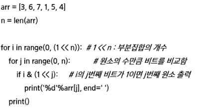

# 20230328

## 부분집합

- 집합에 포함된 원소들을 선택하는 것이다
- 다수의 중요 알고리즘들이 원소들의 그룹에서 최적의 부분 집합을 찾는것. <ex. 배낭짐싸기>

> ###### 단순하게 모든 부분 집합 생성하는 방법

- 4개 원소를 포함한 집합에 대한 power set 구하기
  - 크기가 별로 크고 테스트케이스가 고정적일때나 쓸수있고

```python
for i1 in 0 -> 1
  bit[0] <- i1
  for i2 in 0 -> 1
  bit[1] <- i2
  #계속
```

부분집합 재귀

```python
def f(i, k):
  if i==k:
    print(*bit)
  else:
    bit[i] = 0
    f(i+1, k)
    bit[i] = 1
    f(i+1, k)

A = [7, 2, 5, 3, 4]
N = len(A)
bit = [0] * N  #bit[i] A[i]원소가 부분집합에 포함되는지를 표시함
```

> ###### 부분집합 생성 <바이너리 카운팅>

- Binary Counting
  - 원소 수에 해당하는 N개의 비트열을 이용한다.
  - n번째 비트값이 1이면 n번째 원소가 포함되었음을 의미한다.
- 바이너리 카운팅을 통한 부분집합 생성 코드 예

```python
2^6 -1  = 0부터 63까지 생성
예) 1<<3 3번1비트가 1인 값
i의 j번비트가 1인지 검사하는 코드
내가 검사하려는 j번비트가 0이라면 1<<j 전체가 0이된다
```



## 조합

- 서로 다른 n개의 원소 중 r개를 순서 없이 골라낸 것을 조합(combination)이라고 부른다.
- 재귀 호출을 이용한 조합 생성 알고리즘

```python
an[]: n개의 원소를 가지고 있는 배열
tr[]: r개의 크기의 배열, 조합이 임시 저장될 배열
comb(n, r)
  if (r == 0) print_arr()
  else if (n < r) return
  else
    tr[r-1] = an[n-1]
    comb(n-1, r-1)
    comb(n-1, r)
```

[참고]
10개의 원소 중 3개를 고르는 조합 (n개중 r개를 골라야대 근데 n과 r이 고정이거나 r이 고정인 경우가 꽤 있다. 그럴 때 쓸만함 반복문 가지고 쉽게)
i < j < k 라고 하면,

```python
for i: 0-> 7 (n-3) #j, k로 선택될 원소를 남김
  for j: i+1 -> 8 (n-2) #k로 선택될 원소를 남김
    for k : j+1 -> 9 (n-1)
      f(a[i],a[j],a[k])
```

_↓↓↓↓↓↓↓↓↓↓↓↓↓↓↓↓↓↓↓↓↓↓_

```python
N = 10
for i in range(N-2):
  for j in range(i+1, N-1)
    for k in range(j+1, N):
      print(i, j, k)
```

[참고]
n개에서 r개를 고르는 조합(재귀)
이건 개수가 변하는 경우

```python
def nCr(n, r, s): #n개에서 r개를 고르는 조합, s 선택할 수 있는 구간의 시작
  if r==0:
    print(*comb)
  else:
    for i in range(s, n-r+1):
      comb[r-1] = A[i]
      nCr(n, r-1, i+1)

n = 5
r = 3
comb = [0]*3
A = [i for i in range(n)]
nCr(n, r, 0)
```

## 탐욕알고리즘 그리디(Greedy)

#### 거스름돈 줄이기

#### 배낭 짐싸기(Knapsack)

- 탐욕적으로 접근하면 풀리지않는 예

#### 활동 선택(Activity-selection problem) 문제

ex) 회의실 배정하기

시작시간과 종료시간(sim fi)이 있는 n개의 활동들의 집합 A = {A1,A2,...,An}, 1<= i <= n에서 서로 겹치지 않는(non-overlapping) 최대갯수의 활동들의 집합 S를 구하는 문제

- 탐욕 기법을 적용한 반복 알고리즘

```python
A: 활동들의 집합, S: 선택된 활동(회의)들 집합
si: 시작시간, fi: 종료시간, 1<= i <= n

sort a by finish time
S <- {A1}
j <- 1
For i in 2 -> n
  if si >= fj
    s<- s 합집합 {ai}
    j <- i
```

- 재귀 알고리즘 (근데 활동선택은 걍 반복문이 낫다?)

```python
A: 정렬된 활동 들의 집합
S: 선택된 활동(회의)들 집합
si: 시작시간 , fi: 종료시간, 0<= i <= n+1

Recursive_Selection(i, j)
  m <- i + 1
```
