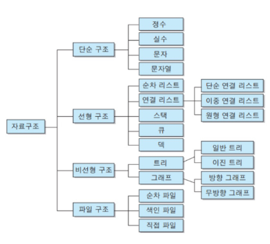
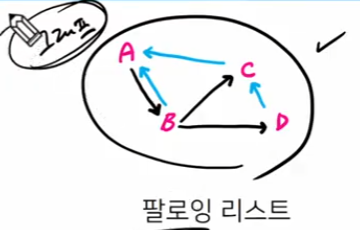
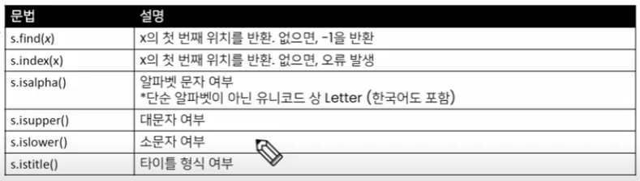
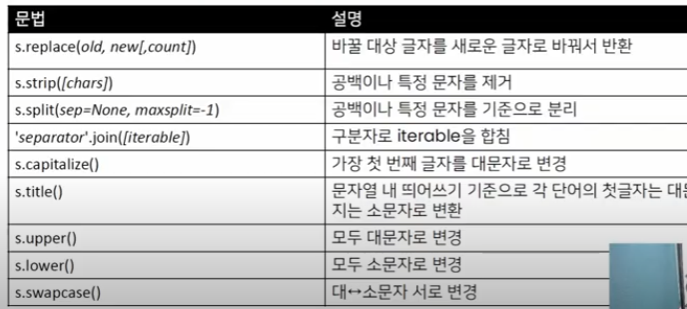
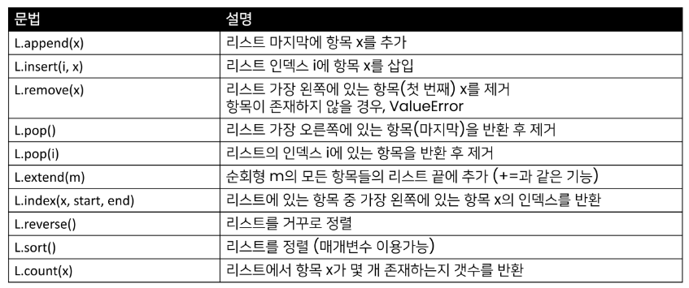

# 2023/01/25

## 데이터구조(Data Structure)

> #### 데이터 구조

- 여러 데이터를 효과적으로 사용, 관리하기 위한 구조(많이 사용해보니까, 비슷한 구조가 있음)

- 파이썬에는 대표적으로 List, Tuple, Dict, Set 등의 데이터 구조가 있음

> #### 자료구조

- 컴퓨터 공학에서는 '자료구조'라고 함

- 각 데이터의 효율적인 저장, 관리를 위한 구조를 나눠 놓은 것

-  

- 스택/ 큐

- 스택 - 후입선출

- 큐 << 선입선출 내가 노래를 듣고싶어, 음악 리스트에 먼저 넣은거부터 나와야지.

- 트리 - 자료구조 생긴게 나뭇가지 같이 생겼다.  

> #### 생각해보기

- 플레이 리스트
  
  - 순서가 있어야할까?  없어도 되지만 있으면 좋다. 하나하나 위에서 아래로 저장을 하면되는 선형구조.

- 팔로잉 리스트
  
  - 그래프

- 자료구조는 매우매우매우매우매우매우 중요하다.

> #### 데이터 구조 활용하기

- 데이터 구조를 활용하기 위해서는 메서드(method)를 사용.
  
  *메서드는 지금은 함수라고 생각하세용
  
   자료 구조가 가지고 있는 함수.
  
  - 메서드는 클래스 내부에 정의한 함수, 사실상 함수 동일
  
  - 쉽게 말하자면 객체의 기능(추후 객체 지향 프로그래밍에서 학습)
  
  - my_list = []
  
  - my_list.append(3)         #[3] 


아 어떠한 데이터 구조가 있다면? .을찍고 머시기머시기하고 소괄호 열고닫으면 파란색 부분은 뭐다? 함수.

ex) 사람.도구쓰기() / 사람.상상하기()  / 까마귀.날기() / 사람.날기()  < xxxx

> #### 파이썬 공식 문서의 표기법

- python 구문이 아니며, 문법을 표현하기 위한 것임

- 아래 예시에서 str.replace(old, new[, count])
  
  - old, new는 필수/ [,count]는 선택적 인자를 의미함(카운트는 있어도되고 없어도된다)

- 공식문서 가서 해보세요.

## 순서가 있는 데이터 구조

> #### 문자열(String Type)

- 문자들의 나열()
  
  - 모든 문자는 str 타입(변경 불가능한 immutable)
    
    - 예를 들어, name = 'aiden' 문자열도 인덱스로 접근 가능. name[0] > 'a' 
    
    - 근데, name[0] = 'b' 이런식으로 변경 불가능
  
  - 문자열은 작은 따옴표(')나


> #### 문자열 조회/탐색 및 검증 메서드

- 
  
  ```python
  print("aiden".find("a"))
  # 0 문자열에 있으면 첫번 째 위치. 
  print("aiden".find("z"))
  #-1 문자열에 없으면 -1
  
  index는 첫번째 위치를 반환, 없으면 오류발생
  ```



> #### 문자열은 (불변형)인데, 문자열 변경되는 이유는?

- 기존의 문자열을 변경하는 게 아니라, 변경된 문자열을 새롭게 만들어서 반환
  
  - ex)replace, strip, title 등
  
  - 그래서 print(string.replace(='_', 'k'))하면 출력이 된다. (_대신 k로 대체해서)
    
    print(sorted(dust))는 None이 나온다.
    
    애초에 리스트는 마음대로 추가하고 뺄 수 있도록 만들어진 것?
    
    문자열은 변경 불가능이니 그에 따른 함수들도 그렇게 정의?
  
  - 

> #### 리스트

-  

-  

-  

-  

-  append와 extend 둘다 데이터를 추가하는 것이지만,
  
  append는 리스트를 통째로 넣을 것이고, extend는 리스트 안의 요소들을 순회해서 하나씩 추가 되기때문에 사용 용도가 다르다.

- sort = 원본 변경 정렬/ sorted= 정렬된 리스트를 반환.(원본 변경 x )

- 
- 
- 
- 
  
  
  
  

> #### 튜플

> #### 튜플의 정의

- 튜플은 여러 개의 값을 순서가 있는 구조로 저장하고 싶을 때 사용
  
  - 리스트와의 차이점은 생성 후, 담고 있는 값 변경이 불가 (불변 자료형)
  
  - 파이썬 내부에서 많이 사용/우리가 직접적으로 만들어 쓰는 경우는 적다.

- 항상 소괄호 형태로 사용

> #### 튜플 관련 메서드

- 튜플은 변경할 수 없기 때문에 값에 영향을 미치지 않는 메서드만을 지원

- 리스트 메서드 중 항목을 변경하는 메서드들을 제외하고 대부분 동일

- 파이썬 공식문서 드가서 튜플 검색해보세용


> #### 연산자

> #### 멤버십 연산자

- 멤버십 연산자 in을 통해 특정 요소가 속해 있는지 여부를 확인

- in / not in 리스트,튜플,레인지,문자열

> #### 시퀀스형 연산자

- 산술연산자(+)
  
  - 시퀀스 간의 concatenation(연결/연쇄)


