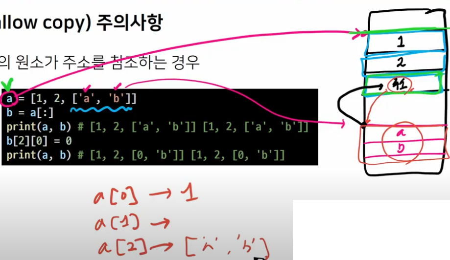

# 2023/01/26

## 데이터구조

> #### 순서가 없는 데이터 구조

> #### 셋(set)

- Set이란 중복되는 요소가 없이, 순서에 상관없는 데이터들의 묶음
  
  - 데이터의 중복을 허용하지 않기 때문에 중복되는 원소가 있다면 하나만 저장
  
  - 순서가 없기 때문에 인덱스를 이용한 접근 불가능

- 수학에서의 집합을 표현한 컨테이너
  
  - 집합 연산이 가능(여집합을 표현하는 연산자는 별도로 존재x)
  
  - 중복된 값이 존재하지 않음

- 담고 있는 요소를 삽입 변경, 삭제 가능 >> 가변 자료형(mutable)

> #### 셋 메서드 (s는 셋)

- 추가 및 변경

        .add(elem) 셋에 값을 추가

```python

```

        .update(*others) 여러 값을 추가

```py

```

- 요소 삭제

        .remove(elem) : set에서 삭제하고, 없으면 KeyError

```python

```

        .discard(elem) : 셋에서 삭제하고 없어도 에러가 발생x

```python

```

        .pop() : 임의의 원소를 제거해 반환

```python

```

- 모두 삭제 : 모든 항목을 제거

```python

```

> #### 집합 관련 함수


> #### 딕셔너리(Dictionary)

*리스트랑 딕셔너리 부터 공략하자. 필수니까

> #### 딕셔너리의 정의

- 키-값(key-value) 쌍으로 이뤄진 자료형

- Dictionary의 키(key)
  
  - key는 변경 불가능한 데이터(immutable)만 활용가능
    
    - string, integer, float, boolean, tuple, range

- 각 키의 값(values)
  
  - 어떠한 형태든 관계없음

> #### 딕셔너리 메서드(d는 딕셔너리)

- d.keys()

- d.values() 

- d.get(k): 키k의 값을 반환하는데, 키k가 딕셔너리 d에 없을 경우 None을 반환. 에러x

- 딕셔너리 값 가져올때 my_dict['pineapple'] 이런 식보다, my_dict.get('pineapple') 이런식으로 쓰는게 더 낫다. 딕셔너리 안에 있는걸 다 알지 못하니

- d.get(k, v): 키k의 값을 반환하는데, 키k가 딕셔너리 d에 없을 경우 v을 반환

- 뷰 < 지금은 반복가능한 객체라고 생각

- 
  
  ## 얕은복사(Shallow Copy), 깊은복사

> #### 자료형과 메모리

*저번에 배웠음 기억나니?

- 데이터 10을 컴퓨터가 기억하는 과정
  
  1.10을 저장할 공간을 메모리에 만들고
  
  2.저장할 공간에 대한 주소를 할당받는다
  
  3.할당받은 주소를 기억했다가(4021555423)

       ~~~~

> #### 기존 변수 사용 과정에서의 문제점?

- 하나의 기억에, 하나의 주소가 필요 ==100개 저장하려면 주소 100개 필요함

- 여러 기억을 하나의 주소로 찾아갈 수 있도록 할 수 없나.

- *연속적인 공간에 데이터가 저장되도록 함==맨 처음 기억의 **주소**만 가지고 있으면 되잖아!

      얕은복사-

      깊은복사-아예 다른 주소에

> #### 복사 방법

- 할당(Assignment)

- 얕은 복사(Shallow copy)

- 깊은 복사(Deep copy)

> #### 할당

- 대입 연산자 (=)
  
  - 리스트 복사 확인하기
    
    ```python
    original_list = [1, 2, 3]
    copy_list = original_list
    print(original_list, copy_list) #[1, 2, 3][1, 2, 3]
    
    copy_list[0] = 'hello'
    print(original_list, copy_list) # ['hello', 2, 3]['hello', 2, 3]
    ```
    
    - 대입 연산자(=)를 통한 복사는 해당 객체에 대한 객체 참조를 복사

> #### 얕은 복사(shallow copy)

- Slice 연산자 활용하여 같은 원소를 가진 리스트지만 연산된 결과를 복사 (다른 주소)
  
  ```python
  a = [1, 2, 3]
  b = a[:]
  print(a, b) #[1, 2, 3][1, 2, 3]
  b[0] = 5
  print(a, b) #[1, 2, 3][5, 2, 3]
  ```
  
  > ##### 얕은 복사 주의사항
  
  - 복사하는 리스트의 원소가 주소를 참조하는 경우
    
    ```
    
    ```



리스트 

> #### 깊은 복사(deep copy)

- 리스트 복사 확인하기

```python
import copy
a = [1, 2, ['a', 'b']]
b = copy.deepcopy(a)
print(a, b) # [1, 2, ['a', 'b']][1, 2, ['a', 'b']]
b[2][0] = 0
print(a, b) #[1, 2, ['a', 'b']][1, 2, [0, 'b']]
```

> #### 결론

- 리스트를 복사하고 싶다는 욕망이 든다면 무조건 print 찍어볼 것!

- 그냥 모두  copy.deepcopy()쓰면 되는거 아닌가요? 
  
  컴퓨터 입장도 생각해줍시다.(메모리 용량 증가)
