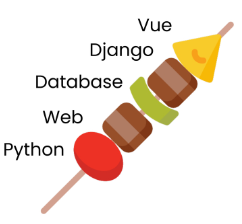
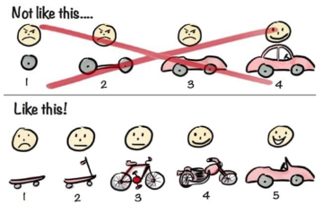

# 2023/01/20

## 관통 프로젝트

> #### 관통 프로젝트란?

- 매 주 금요일에 진행되는 All Day 프로젝트 9~6시.

- 한 주 동안 배운 것을 모두 활용해서 직접 프로젝트에 적용하는 시간(월, 화, 수, 목)

- 단계적 **협업**을 하며 실무 경험을 쌓는 시간

- ~~여러분의 구글 검색 실력이 비약적으로 증가하는 시간~~

- <구글 검색실력 매우 중요> 경험이 많을수록 시간이 줄어듬

- 총 9번의 관통 + 최종 프로젝트(1주)

내가 짠 코드를 남이 이해할 수 있어야하고

남이 짠 코드를 내가 이해할 수 있어야한다.

Git을 잘 활용해보자.

협업 (장고 중후반부터 있을거양)

#### 관통 = 2가지 의미. 월화수목을 관통,

#### 파이썬 웹 데이터베이스 장고 뷰를 관통

> #### 개발자로 가는 길

**알고리즘 + 프로젝트 + 컴퓨터 과학**

이 세가지는 선택이 아니라 필수. 다 갖춰야 개발자로 가는 길이 보여

> #### 알고리즘

- **전략**적인 접근- 그냥 와서 수업듣고 하는거보다, 

- **자주 나오는 개념** 학습

- **난이도 별** 문제풀이

- <mark>일단 '양'을 늘리세요</mark>. '질'은 따라옵니다. 알고리즘은 특히.
  
  미니멈(200문제)

- 코딩테스트 경험

> #### 프로젝트

- 잘한다고 글로만 써져있는 것보다 보여줘야한다. 

- 매력적인 나만의 서비스 x (취업하는건데 원하는 인재가 되야지)

- 기술을 활용할 수 있음 O 

- 현업에서 원하는 기술 사용 O <<취업공고에 지원자격 우대사항 보면 나와있음

- 협업할 수 있는 인재 O > GIT쓰는 능력, 문서화(다른 사람이 이해 할 수 있도록 작업하는가)

- 문제 해결 능력 어필 O 

    구글 검색해서 블로그검색해서 한 사람과 공식문서 보고 한 사람 중 누굴 우대할까?  공식문서,, 중요!!

하다 못해, 돌아가게는 만들어라. 작은 단계부터 만들어 가는 연습. 처음부터 예쁜 바퀴를 만들겠다? X

> #### 컴퓨터 과학
> 
> 이론적인 부분이 크다.(전공자와 비전공자의 차이가 가장 크게 나는 부분)

- '시나브로'의 힘 < 모르는 사이에 조금씩 조금씩

- 혼자 X 같이 O. 혼자하면 멀리 못간다. CS는 같이해야댕

- 스터디 적극 권장. 하루에 30분만 해도 쌓이면 엄청남

- 책/유튜브/블로그(자료가 없어서 못한다는 xxx)

- 선택이 아닌 필수 (면접)

## 

## 명세서 읽어보기

오늘 명세서 읽어보면서 코딩해야댕

> #### 명세서 구조

- 목표

- 준비사항- 프로그래밍 언어, 라이브러리, 외부 데이터 등

- **요구사항**- 제시된 요구사항에 맞춰서 개발 진행
  
  - **필수 요구사항**  
  
  - 선택 요구사항 < 시간 남으면 해보면 좋아용. 나중가면 필수겠죠잉

- 제출

요구 사항을 바탕으로 **분석**(60~80%써도 됨)하고, 구현할 수 있는 능력을 키우자.

> #### 01. Python을 활용한 데이터 수집

VSCode 켜고 변수부터 만들지 말고, 우선 흰 종이를 꺼내자.

생각하는 시간 > 코딩하는 시간이 되어야 한다.

키보드 손떼고 일단 생각하고 **구조화**하자!

.PDF 명세서와

데이터가 나간다.

