# 파이썬: 함수

## 함수

- 함수를 왜 사용할까요?
  
  - Decomposition(분해)
    
    기능을 분해하고 재사용 가능하게 만들고
    
    - len([1, 2, 3])
      
      이 코드를 손수 구현하면 아래와 같이 된다.
      
      ```python
      numbers = [1, 2, 3]
      count = 0
      for i in [1, 2, 3]:
          count += 1
      print(count) #3
      ```

                       어떤게 더 편한가?

- - - sum([1, 2, 3])
      
      이 코드의 뜻은?
      
      이 코드를 손수 구현하면?
    
    - 

- 이 코드를 보면 어떤가?
  
  - **간결하고 이해하기 쉽다.**
  
  - Abstraction = 복잡한 내용을 모르더라도 사용할 수 있도록(스마트폰) 재사용성과 가독성, 생산성
    
    - 우리가 자주 사용하던 print 함수를 살펴보자.
      
      - 어떻게 구현할 수 있을까?
    
    - 사실 내부 구조를 변경할게 아니라면 몰라도 무방
      
      - 그것이 함수의 장점이자 프로그래밍의 매력
      
      - 스마트폰의 원리를 잘 몰라도 우리는 잘 사용가능

## 함수 기초

#### 함수의 종류

- 함수는 크게 3가지로 분류
  
  - 내장 함수
    
    - 파이썬에 기본적으로 포함된 함수
  
  - 외장 함수
    
    - import 문을 통해 사용하며, 외부 라이브러리에서 제공하는 함수
  
  - 사용자 정의 함수
    
    - 직접 사용자가 만드는 함수

- 함수(Function)
  
  - 특정한 기능을 하는 코드의 조각(묶음)
  
  - 특정 코드를 매번 다시 작성하지 않고, 필요시에만 호출하여 간편히 사용

#### 함수 기본 구조

- 선언과 호출(define & call) : def

- 입력(Input)

- 문서화(Docstring) : 이 함수가 어떤 기능을 하는지 적는?

- 범위()

- 결과값(Output) : 처리를 하고 나온 결과값

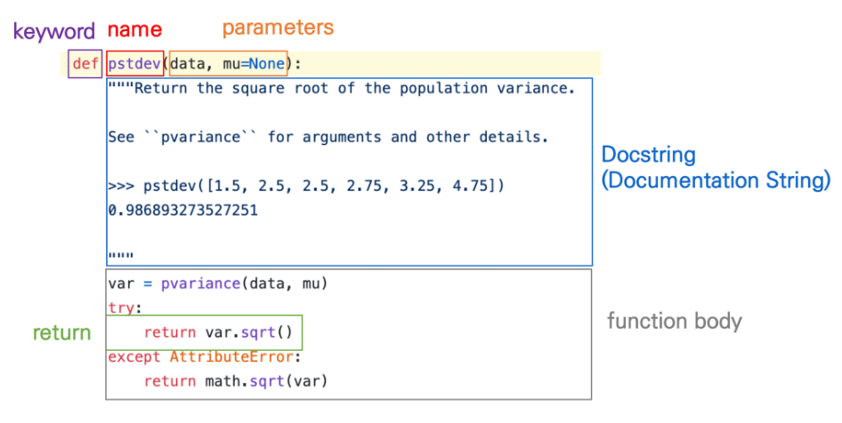

↑구조를 외워! def name parameters

def를 쓰고 내가 쓰고싶은 함수의 이름을 씀. 소괄호를 열고, 함수에 들어가는 input들을 적음 마지막에 : 붙여주고

결과 값을 return 이라는 걸로 밖으로 빼준다

parameter  argument

dust = 60 과 다를게 없다. ham = 'spam'

dust = 60

dust_val = dust

> #### 선언과 호출(define & call)

- 함수의 선언은 def 키워드를 활용함

- 들여쓰기를 통해 Function body(실행될 코드)

#### 함수의 정의

- 함수를 사용하기 위해서는 먼저함수를 정의해야함
  
  def function_name(parameter):
  
      # code block
  
      return returning_value

- 함수는 함수명()으로 호출하여 사용
  
  - parameter가 있는경우, 함수명(값1, 값2, ...)으로 호출
    
    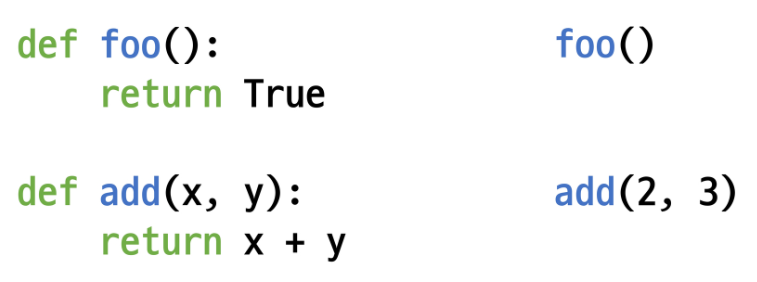

#### 함수 실행 순서 예시

- 이 코드의 실행 결과는 왜 9일까요?

- 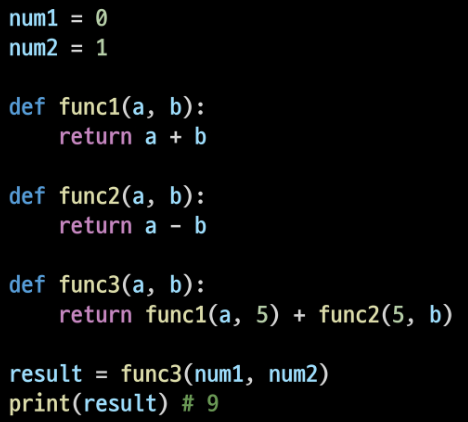

0 + 5 + 5 - 1 = 9

- 함수는 호출되면 코드를 실행하고 return 값을 반환하며 종료된다.

## 함수의 결과값(Output)

> #### 값에 따른 함수의 종류

- Void function
  
  - 명시적인 return 값이 없는 경우, None을 반환하고 종료 - none 뜨면 리턴 안썻구나 하세용

- Value returning function
  
  - 함수 실행 후, return문을 통해 값 반환
  
  - return을 하게 되면, 값 반환 후 함수가 바로 종료
  
  > 주의 - print vs return
  
  - print 함수와 return의 차이점
    
    - print를 사용하면 호출될 때마다 값이 출력됨(주로 테스트를 위해 사용)
    
    - 데이터 처리를 위해서는 return 사용

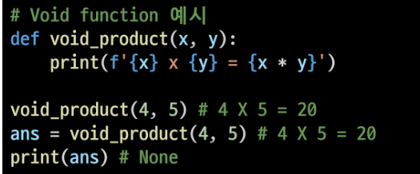

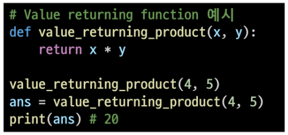

- - - REPL(Read-)(주피터노트북 같은) 환경에서는 마지막으로 작성된 코드의 리턴 값을 보여주므로 같은 동작을 하는 것으로 착각할 수 있음(return은 out이 뜸?)

> #### 두개 이상의 값 반환

- 아래 코드의 문제점은 무엇일까?

```python
def minus_and_product(x, y):
    return x - y
    return x * y

y = minus_and_product(4, 5)
print(y) # -1
```

- return은 항상 하나의 값 만을 반환

두개 이상의 값을 반환 하는 방법

```python
def minus_and_product(x, y):
    return x - y, x * y

y = minus_and_product(4, 5)
print(y) # (-1, 20)
print(type(y)) #<class 'tuple'>


###############################
if x < y :
    return x * y
else :
    return x - y
```

콤마를 써. 튜플형태로 나옴 ( 근데 왜 하필 튜플로 묶어줄까?)

시험안나왕

1.    dict << k: v 인데, 굳이 파이썬이 그걸? 구조상 기각

2.    set 

3.    list > mutable 

4.    tuple > immutable 함수의 결과가 바뀌면 안되서?

> #### 함수 반환 정리

- return x > none

- return o > 하나를 반환
  
  여러 개를 원하면 , tuple 활용(혹은 리스트와 같은 컨테이너 활용)

```python

```

## 함수의 입력(Input)

> #### Parameter와 Argument

- parameter

- Argument
  
  - 함수 호출 시 함수의 parameter를 통해 전달되는 값

> #### Positional Arguments

- 기본적으로 함수 호출 시 Argument는 위치에 따라 함수 내에 전달됨

- 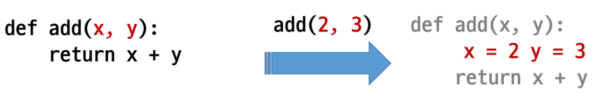

> #### Keyword Arguments

- 직접 변수의 이름으로 특정 Argument를 전달할 수 있음-

- Keyword Argument 다음에 Positional Argument를 활용 할 수 없음 ex) add(x=2, 5) 이런거 안댐 add(2, y=5)는 됨                                       add(y=5, x=2)도 나옴

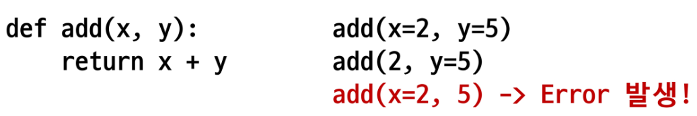

> #### Default Arguments Values

- 기본값을 지정하여 함수 호출 시 argument 값을 설정하지 않도록 함
  
  - 정의된 것보다 더 적은 개수의 argument 들로 호출될 수 있음

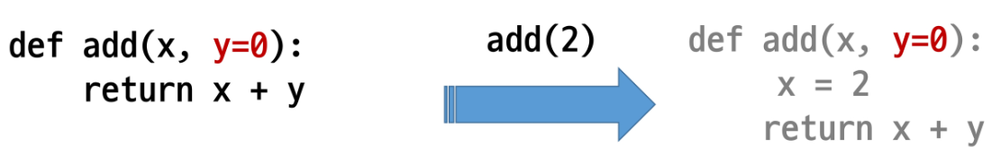

## Python의 범위(Scope)

> #### python의 범위(Scope)

namespace

1. built in namespace : 내장된

2. global namespace:

3. enclosing n : 우리가
   
    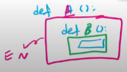

4. local n :내가 어떤 함수를 실행할 때 함수 안쪽에 생성되는 네임스페이스

이름을 기억하는 곳이 여러곳이라면 같은 이름이 들어 있을 수 있다. 어떤 공간에 있는 '같은 이름'을 가져와야될지 규칙이필요. 여기서 나오는게 Scope(변수의 제한범위) 내가 찾고자 하는 프로그램상 범위

본인기준. 

작은 순서 **L  E G B** 순서로 찾음. B에도 없으면 에러남


- 함수는 코드 내부에 local scope를 생성하며,
  
  그 외의 공간인 global scope로 구분

- scope
  
  - global scope: 코드 어디에서든 참조할 수 있는 공간
  
  - local scope: 함수가 만든 scope. **함수 내부에서만** 참조 가능

- variable(변수)
  
  - global variable : global scope에 정의된 변수
  
  - local variable : local scope에 정의된 변수

> #### 변수 수명주기(lifecycle)

- 변수는 각자의 수명주기가 존재
  
  - built-in scope
    
    - 파이썬이 실행된 이후부터 영원히 유지
  
  - global
    
    - 모듈(안배웠으니 일단 .py라고 생각하고있어)이 호출된 시점 이후 혹은 인터프리터가 끝날 때까지 유지
  
  - local
    
    - 함수가 호출될 때 생성되고, 함수가 종료될 때까지 유지
  
  - 예시

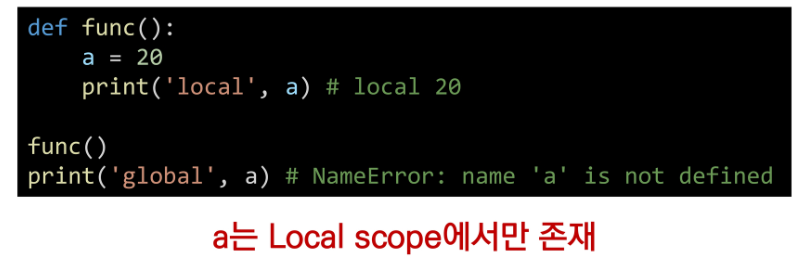

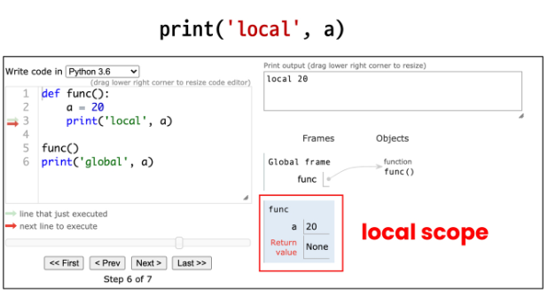

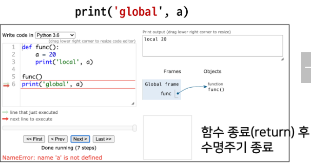

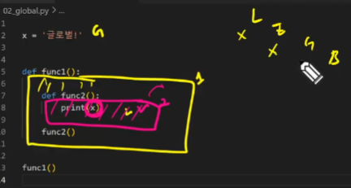

같은 이름으로 x가 되어있을때  ↑ '글로벌' 출력

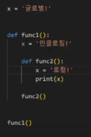

↑ '로컬' 출력

내가 지금 실행할 네임스페이스에 뭐가 들어있는지 볼 수있다.

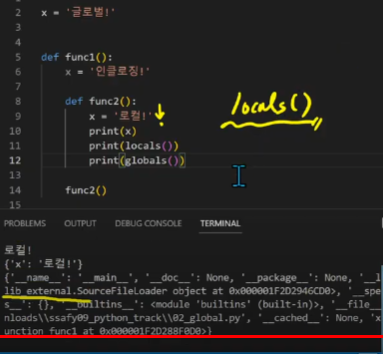

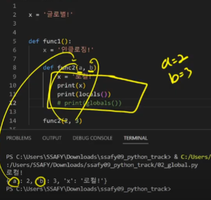

mutable

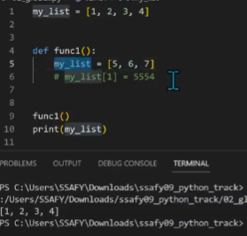

my_list[1]일땐 결과값으로 1, 5554, 3, 4가 나오지만 

그냥 이름인 my_list일땐 [1, 2, 3, 4]가 출력

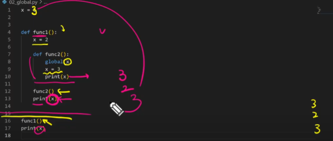

global x 글로벌에 있는거 바꿈

nonlocal x << 나랑 가장 가까운 네임스페이스에 접근

이름 검색  규칙

- 함수 내에서는 바깥 scope의 변수에 접근 가능하나 수정은 할 수 없음 >> 

함수의 범위 주의

- 기본적으로 함수에서 

- - 
  
  - 
  
  - **단, 함수 내에서 필요한 상위 scope변수는 argument로 넘겨서 활용할 것**

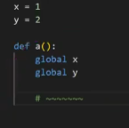

↑이런거 쓰면 안된다. (알고리즘 할땐 그래도 큰 도움이 되긴하는데 그래도 안쓰는게 낫다. 알규먼트로 넘겨서 안쪽에서 활용?)

- 상위 scope에 있는 변수
