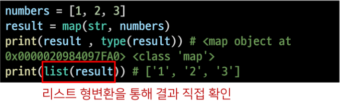
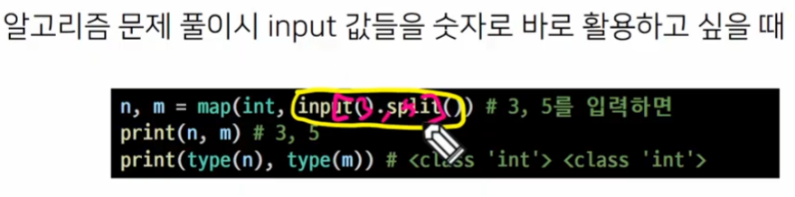
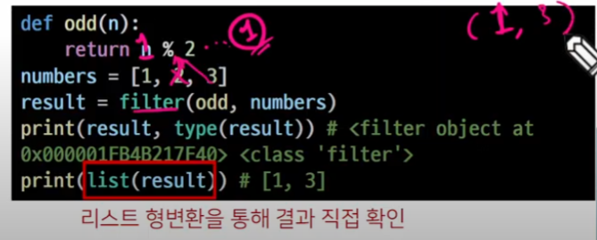
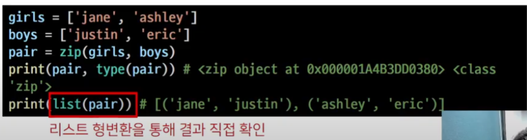
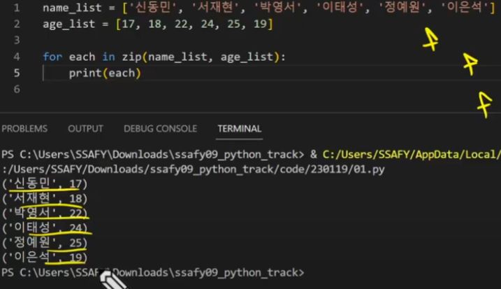
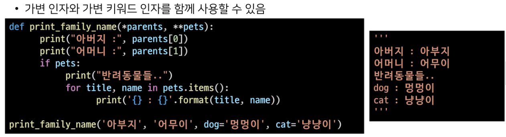

# 2023/01/19

## 함수 응용

> #### 내장 함수(Built-in)

- 파이썬 인터프리터에는 항상 사용할 수 있는 많은 함수와 형(type)이 내장되어 있음. -> 구글에 Python built-in Functions.

> ##### map

 map(function, iterable)

- 순회 가능한 데이터구조(iterable)의 모든 요소에 함수(function)적용하고, 그 결과를 map object로 반환

- 

- 
  
  function에 호출x 적용

```python
def my_magic_func(n):
    return n * 10

my_list = [1, 2, 3, 4, 5]

rlt = map(my_magic_func, my_list)
print(list(rlt))
```


알고리즘 풀 때 많이 쓸거양



> #### filter

filter(function, iterable)

- 순회 가능한 데이터구조(Iterable)의 모든 요소에 함수(funtion)적용하고, 그 결과가 True인 것들을 filter object로 반환
  
  


> #### zip

zip(*iterables) << 앞에 것들은 iterable 1개. 이건 s

- 복수의 iterable을 모아 튜플을 원소로 하는 zip object를 반환



```python
name_list = ['신동민', '서재현', '박영서', '이태성', '정예원', '이은석']

```



> #### lambda 함수

lambda[parameter] : 표현식

- 람다함수 << 이름을 안 짓는 함수(익명함수)
  
  - 표현식을 계산한 결과값을 반환하는 함수로, 이름이 없는 함수여서 익명함수라고도 불림

- 특징
  
  - return문을 가질 수 없음
  
  - 간편 조건문 외 조건문이나 반복문을 가질 수 없음

- 장점
  
  - 함수를 정의해서 사용하는 것보다 간결하게 사용 가능
  
  - def를 사용할 수 없는 곳에서도 사용가능
  
  함수를 왜 쓰냐 생각해보면 함수는 복잡한 명령을 편하게 사용할 수 있도록 해주는 것, 그게 함수의 본질. 근데 만약에 정말 너무너무 간단한 함수가 있다. 로직이 정말 간단해. 근데 그 간단한 함수를 작성할때도 def 하고 함수이름쓰고 매개변수적고 : 적고 들여쓰기하고 리턴적고 뭔가 적어줘야된다. 또는 함수를 만들긴 만들어야하는데 딱한번만 쓰고 이제 안쓸건데, 여기있는 코드줄에서만 쓸건데, 그런 경우 
  
  ```python
  def my_magic_func(n):
      return n * 10
  map_obj = map(my_magic_func, [1, 2, 3])
  rlt = list(map_obj)
  
  print(rlt)
  
  ```


이런 방식을 람다함수는, 

lambda 매개변수: 매개변수를 이용한 리턴값.

```py
rlt = (lambda x: x * x)(4)


my_func = lambda n: n * 2
my_func(2)
```


> #### 재귀함수

- 자기 자신을 호출하는 함수.
  
  단점으로 내 머릿속에 한계가 오죵 그래서 어떻게 해야되냐. 재귀형태를 뛴다? 그럼 무조건 종이를 꺼내고 펜을꺼내서 그림을 그려봐. fac(5)가 5 x fac(4)를 부르네, 그리고 fac(4)가 4x fac(3)을 부르네, - - - - -fac(1)일때 1x fac(0)을 부르네, 근데 fac(0)일때 리턴으로 1 반환해주기로 했으니(0! = 1), 근데 순서가, 0부터 계산이 된다? 0 > 1 > 2 > 3 > 4   > 5 순서

```python
def fac(n):
    if n == 0:
        return 1
    return n * fac(n - 1)

print(fac(5))
```

- 무한한 호출을 목표로 하는 것이 아니며, 알고리즘 설계 및 구현에서 유용하게 활용.

- 1개 이상의 종료되는 상황을 만들어줘야된다.

> > 반복문과 재귀 함수 비교
> > 
> > - 알고리즘 자체가 재귀적인 표현이 자연스러운 경우 재귀함수를 사용
> > 
> > - 재귀호출은 변수 사용을 줄여줄 수 있다.
> > 
> > - 재귀호출은 입력값이 클수록 연산이 느려짐?

## 패킹/언패킹(Packing/Unpacking)

> #### 패킹/언패킹 연산자(Packing/Un Operator)*별표!!

- 패킹이 뭡니까. 짐싸는거. 묶는거. /언패킹? 푸는거.

    

- (py파일 보고 필기 정리하자.)

언패킹


> #### 정해지지 않은 여러개의 Arguments 처리


> #### 가변인자()


> #### 가변키워드 인자


> #### 가변 인자와 가변키워드 동시 사용



* 가변 키워드인자가 가변 인자 앞에 있을 순 없다.

* 가변인자 먼저, 그다음 키워드인자


## 모듈

> #### 모듈과 패키지

 합, 평균, 표준편차, ... 자주 쓰는 기능들 >> 함수로 만듬

- 다양한 기능을 하나의 파일로 (모듈, module) .py

- 그러한 다양한 파일을 하나의 폴더로 (패키지, package) 폴더

- 그러한 폴더들을 여러개 묶어놓은 (라이브러리, library)   폴더

이것을 관리하는 관리자(pip)


패키지의 활용 공간 (가상환경)


> #### 모듈과 패키지 불러오기

import 파일명.기능 이런식으로 모듈을 가져올수 있다.

from 파일명 import 기능 이런식으로도 가능

from 파일명 import * 을 쓰면 그 모듈 안에 모든 것 가능.

from 패키지 import 파일명

from 패키지.파일명 import 기능


## 파이썬 라이브러리

> #### 파이썬에 기본적으로 설치된 모듈과 내장 함수

- 파이썬에 기본적으로 설치된 모듈과 내장 함수
  
  - 예시 - random.py

```python
import random
num_list = [1, 2, 3, 4]
random.shuffle(num_list)
print(num_list)
###########################
from random import shuffle
num_list = [1, 2, 3, 4]
shuffle(num_list)
print(num_list)
```

> #### 파이썬 패키지 관리자(pip)

- PyPI(Python Package Index)에 저장된 외부 패키지들을 설치하도록 도와주는 패키지 관리 시스템

- 패키지 설치
  
  - 최신 버전/ 특정 버전/ 최소 버전을 명시하여 설치할 수 있음
  
  - 이미 설치되어 있는 경우 이미 설치되어 있음을 알리고 아무것도 하지 않음
    
    - $ pip install SomePackage
    
    - $ pip install SomePackage==1.0.5
    
    - $ pip install SomePackage>=1.0.4
    
    모두 bash, cmd 환경에서 사용되는 명령어

- 패키지 삭제
  
  - - $ pip uninstall SomePackage

- 패키지 목록 및 특정 패키지 정보
  
  - - $ pip list - 파이썬 환경에 설치된 모든(외부?)목록
    
    - $ pip show SomePackage -설치된 패키지에 대한 정보

- 패키지 관리하기
  
  - 아래의 명렁어들을 통해 패키지 목록을 관리[1]하고 설치할 수 있음[2]
  
  - 일반적으로 패키지를 기록하는 파일의 이름은 requirements.txt로 정의함
    
    - $ pip freeze >> requirements.txt
    
    - $ pip install - r requirements.txt

- 패키지 안에 . ______ init _____.pt (언더바 2개 init 언더바2개.py)
  
  

## 가상환경

> #### 가상환경

- 파이썬 표준 라이브러리가 아닌 외부 패키지와 모듈을 사용하는 경우 모두 pip를 통해 설치 해야 함

- 복수의 프로젝트를 하는 경우 버전이 상이 할 수 있음.
  
  - 과거 외주 프로젝트 - django 버전 2.x
  
  - 신규 회사 프로젝트 - django 버전 3.x

- 이러한 경우 가상환경을 만들어 프로젝트별로 독립적인 패키지를 관리할 수 있음.

- 가상환경을 만들고 관리하는데 사용되는 모듈(Python 버전 3.5부터)

- 특정 디렉토리에 가상 환경을 만들고, 고유한 파이썬 패키지 집합을 가질 수 있음
  
  - 특정 폴더에 가상 환경이(패키지 집합 폴더 등)있고
  
  - 실행환경(예-bash)에서 가상환경을 활성화시켜
  
  - 해당 폴더에 있는 패키지를 관리/사용함

> #### 가상환경 생성

- 가상환경을 생성하면, 해당 디렉토리에 별도의 파이썬 패키지가 설치됨

- 바탕화면에 새로운 폴더 만들어,

- 그 폴더 들어가서 Git bash 켜.

- $ python -m venv <폴더명>
  
  ex) **$ python -m venv venv**  (좀 오래걸려~~)
  
  - 가상환경 실행 (윈도우는 Scripts, 맥은 bin)
  
  **$ source venv/Scripts/activate**
  
  - 가상환경 종료

     **$ deactivate**

- $ pip list << 목록

- $ pip freeze > 

- $ pip install -r 파일명.txt <적혀있는거 다 깔아줌


1. 왜 git 관리 중인 파일에 하지말라고 하는가?

2. 왜 txt 파일로 만드나?

예를들어, 장고를 이 가상환경 폴더에 설치를 했잖아, 그럼 장고에서 쓰는 코드들을 다 가지고온거야, 이 가상환경에서 쓰는 파일이 커지면 커질수록 파일이 잔뜩 늘어나
