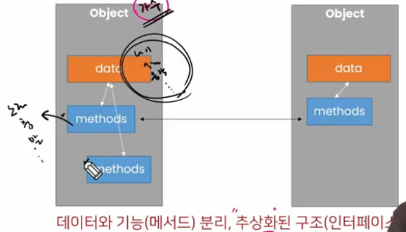

# 20230130

## 객체지향 프로그래밍1

> #### 객체 지향 프로그래밍(oop)

*Object-Oriented Programming

C++ 등

- 컴퓨터 프로그래밍의 패러다임 중 하나.
  
  컴퓨터 프로그램을 **명령어의 목록으로 보는 시각에서 벗어나 여러 개의 독립된 단위**, 즉, "객체"들의 모임으로 파악하고자 하는 것이다. 각각의 **객체**는 **메시지**를 주고받고, **데이터**를 처리할 수 있다.
  
  EX) 콘서트
  
  - 가수 객체
  
  - 감독 객체
  
  - 관객 객체

> #### 절차 지향 프로그래밍

 C언어 등

- 프로그램이 하나의 흐름.

- 프로그램 전체가 유기적인 흐름으로 연결.

- 기능 중심의 프로그램

- 순서가 정해져 있으므로 실행이 빠름

BUT, 프로그램이 커진다면?

- 하드웨어가 발전함에 따라 소프트웨어도 점점 커지고 복잡한 설계가 요구됨. 하드웨어의 발전 속도를 소프트웨어의 발전 속도가 따라가지 못함
  
  **소프트웨어 위기**

- 절차지향 방법론은 생산성이 너무 낮다.

- '절차' 대신 핵심이 되는 '데이터'를 중심으로 생각하자 

- **데이터를** 중심으로 절차를 도입해서, 현실의 사물을 나타내고 이런 것들을 **조립**하는 방식으로 개발하자 == oop

펄슨이라는 객체를 만드려면 그들의 공통점을 뽑아?

하나 잘만들어놓으면 철수도 만들고 영희도 만들겠지?

> #### 객체 지향 프로그래밍의 장/단점



- 장점
  
  - 객체는 잘 만들어놓으면 계속해서 재사용이 가능!
  
  - 객체는 그 자체로 데이터와 행동이 정의됨(**독립적**) == 개발자가 내부 구조를 몰라도 그냥 가져다가 다른 객체와 조립하면서 개발이 가능
  
  - 객체 단위로 모듈화시켜 개발할 수 있으므로 많은 인원이 참여하는 대규모 소프트웨어 개발 가능
  
  - 개발 용이성, 유지 보수 편의성, 신뢰성을 바탕으로 **생산성이 대폭 증가**!

- 단점
  
  - 설계시 많은 노력과 시간이 필요함.
    
    - 다양한 객체들의 상호작용구조를 만들기 위해 많은 시간과 노력이 필요
  
  - 실행속도가 상대적으로 느림
    
    - 절차지향프로그래밍이 컴퓨터의 처리구조와 비슷해서 실행 속도가 빠름

## OOP 기초

> #### 객체(컴퓨터과학)

컴퓨터 과학에서 **객체** 또는 오브젝트는 **클래스에서 정의한 것**을 토대로 **메모리(실제 저장공간)에 할당**된 것으로 프로그램에서 사용되는 데이터 또는 식별자에 의해 참조되는 공간을 의미하며, 변수, 자료구조, 함수 또는 메서드가 될 수 있다. 

*

- 속성과 행동으로 구성된 모든 것
  
  - 객체 예시(가수)
  
  - 속성(정보: 변수) = 직업, 생년월일, 국적 등
  
  - 행동(동작: 함수-메서드) = 랩하기(), 댄스()

> #### 객체와 인스턴스

- 클래스로 만든 객체를 **인스턴스** 라고도 함
  
  - 객체와 인스턴스의 차이점?
  
  클래스(설계도) 가수 >> 이찬혁은 객체다o
  
                                           이찬혁은 인스턴스다x
  
                                   이찬혁은 가수의 인스턴스다o

> #### 클래스와 객체

> #### 객체

파이썬은 모든 것이 객체(object)

 == 파이썬의 모든 것엔 속성과 행동이 존재

*함수를 만드는 것과 클래스를 만드는 것의 차이점.

- 함수는 기능만 하고 끝. 

- 클래스는 데이터와 함수를 한 곳으로 묶어준다.

*나만의 클래스를 만들수 있다.

## 

## 객체와 클래스 문법

> #### 기본 문법

- 클래스 정의  class MyClass:

                                  pass

- 인스턴스 생성

- 메서드 호출

- 속성 접근

```python
- 클래스 정의 
class MyClass:
    pass

- 인스턴스 생성 
my_instance = Myclass()

- 메서드 호출 
my_instance.my_method()

- 속성 접근 
my_instance.My_attribute()
```

클래스 : 객체들의 분류 / 설계도(class)

인스턴스: 하나하나의 실체 / 예(instance)

```python
class Person:
    pass
print(type(Person)) # <class 'type'>
person1 = person()
print(isinstance(person1, Person)) #True
print(type(person1)) #<class '__main__.Person'>
```

> #### 객체 비교하기

- ==
  
  - 동등한(equal)
  
  - 변수가 참조하는 객체가 동등한(내용이 같은) 경우 True
  
  - 두 객체가 같아 보이지만 실제로 동일한 대상을 가리키고 있다고 확인해 준 것은 아님

- is
  
  - 동일한(identical)
  
  - 두 변수가 동일한 객체를 가리키는 경우 True

```python
a = [1, 2, 3]
b = [1, 2, 3]
print(a == b, a is b) # True False

a = [1, 2, 3]
b = a
print(a == b, a is b) # True True
```

> #### 속성

- 특정 데이터 타입/클래스의 객체들이 가지게 될 상태/데이터를 의미

- 클래스 변수/인스턴스 변수가 존재

```python

```

> #### 인스턴스와 클래스 간의 이름 공간(namespace)

- 클래스를 정의하면, 클래스와 해당하는 이름 공간 생성

- 인스턴스를 만들면, 인스턴스 객체가 생성되고 이름 공간 생성

- 인스턴스에서 특정 속성에 접근하면, 인스턴스-클래스 순으로 탐색 

```python

```

> #### 인스턴스 변수

- 인스턴스 변수란?
  
  - 인스턴스가 개인적으로 가지고 있는 속성(attribute)
  
  - 각 인스턴스들의 고유한 변수

- 생성자 메서드(______init______)에서  self.<name>으로 정의

- 인스턴스가 생성된 이후 <instance>.<name>으로 접근 및 할당

```python
class Person:
    def __init__(self, name): #인스턴스 변수 정의
        self.naem = name
        # __init__ << person이라는 클래스를 생성할 때, 
        # 생성자라고 함?
john = Person('john')
```

> #### 클래스 변수

- 클래스 변수

> #### 클래스 변수 활용(사용자 수 계산하기)

- 사용자가 몇 명인지 확인하고 싶다면?
  
  - 인스턴스가 생성 될 때마다 클래스 변수가 늘어나도록 설정할 수 있음

```python
class Person:
    count = 0
    # 인스턴스 변수 설정
    def __init__(self, name):
        self.name = name
        person.count += 1
```

## OOP 메서드

클 > 인 불가능 / 인 > 클 가능.

> #### 메서드

- 특정 데이터 타입/클래스의 객체에 공통적으로 적용 가능한 행위(함수)

```python
class Person:
#기본적으로 아무것도 하지않고있는 __init__ 이 보이지는 않지만
#파이썬 내부에 존재 중. 내가 필요할
    def talk(self): #<< 인스턴스 메서드
        print('안녕') #왜? 함수 인자자체가 인스턴스가 들어가야되서
    def eat(self, food):
        print(f'{food}를 냠냠')

person1 = Person
person1
person1
person1
```

> #### 메서드의 종류

- 인스턴스 메서드 (인스턴스 변수를 사용하겠다)

- 클래스 메서드 (클래스변수를 사용하겠다)

- 정적 메서드 ()

> #### 인스턴스 메서드

*우리가 대부분 사용하는 메서드!

- 인스턴스 변수를 사용하거나, 인스턴스 변수에 값을 설정하는 메서드

- 클래스 내부에 정의되는 메서드의 기본

- 호출 시, 첫번째 인자로 인스턴스 자기자신(self)이 자동으로 전달됨

> > #### self

- 인스턴스 자기자신

- 파이썬에서 인스턴스 메서드는 호출 시 첫번째 인자로 인스턴스 자신이 전달되게 설계
  
  - 매개변수 이름으로 self를 첫번째 인자로 정의
  
  - 다른 단어로 써도 작동하지만, 파이썬의 암묵적인 규칙

- 

> > #### 매직 메서드
> 
> *특별한 인스턴스 메서드

- Double underscore(____)가 있는 메서드는 특수한 동작을 위해 만들어진 메서드로, 스페셜 메서드 혹은 매직 메서드라고 불림

- 특정상황에 자동으로 불리는 메서드.

```python
# 예시)
__str__(self)
```

```python
class Person:
    def __init__(self):
        print('생성될 때 자동으로 불려요.')
JB = person('JB', 20)

```


> > 

> > #### 생성자(constructor)메서드

-   

-  


> #### 클래스 메서드

- 클래스가 사용할 메서드

- @classmethod 데코레이터를 사용하여 정의

- 호출 시, 첫번째 인자로 클래스(cls)가 전달됨


```python

```

> #### 데코레이터


> #### 스태틱 메서드

- 인스턴스 변수, 클래스 변수를 전혀 다루지 않는 메서드
  
  (첫번째 인자로 cls도 self도 받지않는 메서드)

- 언제 사용하는가?
  
  - 속성을 다루지 않고 단지 기능(행동)만을 하는 메서드를 정의할때, 사용


