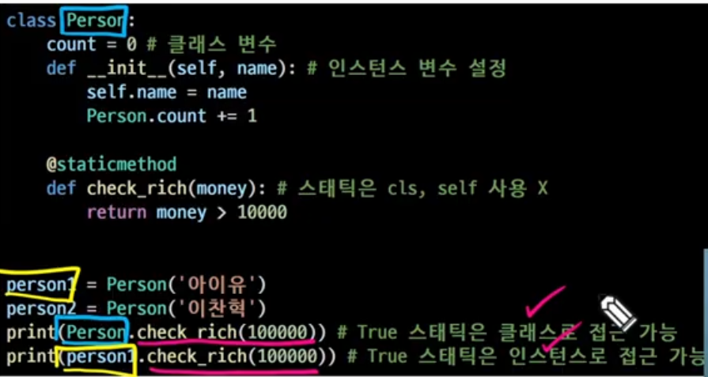
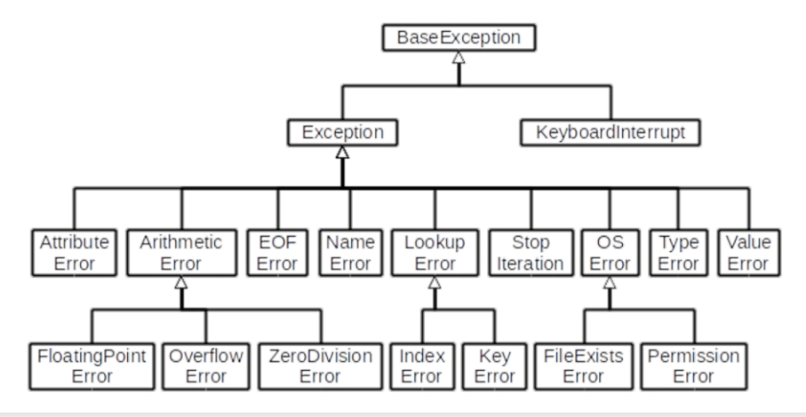
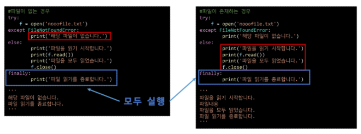

# 20230131

## 복습

> #### 클래스 메서드

- 클래스가 사용할 메서드

- @classmethod 데코레이터를 사용하여 정의

- 호출 시, 첫번째 인자로 클래스(cls)가 전달됨

```python
class MyClass:
    name = haha
    @classmethod
    def class_method(cls, arg1, _):
        cls.name
```

데코레이터는 파이썬스럽게 만들어줌. 유용함.

편하다, 코드가 줄어든다

> #### 데코레이터

- 함수를 어떤 함수로 꾸며서 새로운 기능을 부여

- @데코레이터(함수명) 형태로 함수 위에 작성

- 순서대로 적용되기때문에 작성순서가 중요

> #### 클래스 메서드와 인스턴스 메서드

- 클래스 메서드 -> 클래스 변수 사용

- 인스턴스 메서드 -> 인스턴스 변수 사용

- 그렇다면 인스턴스 변수, 클래스 변수 모두 사용하고 싶다면?
  
  - 클래스는 인스턴스 변수 사용이 불가능
  
  - 인스턴스 메서드는 클래스 변수, 인스턴스 변수 둘 다 사용이 가능

> #### 스태틱 메서드

- 인스턴스, 클래스 변수를 전혀 다루지않는 메서드

- 속성을 다루지않고 단지 기능(행동)만을 하는 메서드를 정의할 때, 사용

- 객체 상태나 클래스 상태를 수정할 수 없음.

- 

## 객체 지향의 핵심 개념

- 추상화: 핵심이 되는 부분만 추리기
  
  - 복잡한 것은 숨기고, 필요한 것만 드러내기

- 상속:  코드의 재사용성을 ↑ + 기능을 확장

- 다형성: 각자의 특성에따라 다른 결과 만들기

- 캡슐화: 데이터 보호하기

## 상속

- 상속이란
  
  - 두 클래스 사이 부모-자식 관계를 정립하는 것

- 클래스는 상속이 가능함
  
  - 모든 파이썬 클래스는 object를 상속 받음
    
    ```python
    class ChildClass(ParentClass):
        pass
    ```

- 하위 클래스는 상위 클래스에 정의된 속성, 행동, 관계 및 제약 조건을 모두 상속받음

- 부모클래스의 속성, 메서드가 자식 클래스에 상속되므로, 코드 재사용성이 높아짐
  
  > #### 상속 - 상속없이 구현하는 경우1
  
  - 학생/교수 정보를 나타내기 어려움
  
  - 
  
  > #### 상속- 상속없이 구현하는 경우2
  
  - 메서드 중복 정의
  
  - 
  
  > #### 상속을 통한 메서드 재사용
  
  -  
  
  > #### 상속 관련 함수와 메서드
  
  - isinstance(object, classinfo)
    
    - classinfo의 instance거나 subclass*인 경우 True
  
  - issubclass(class, classinfo)
    
    - class가 classinfo의 subclass면 True
    
    - classinfo의 모든 항목을 검사
  
  - **super()**
    
    - 자식클래스에서 부모클래스를 사용하고 싶은 경우
  
  > #### 상속 정리
  
  -  파이썬의 모든 클래스는 
  
  -  
  
  -  
  
  -  
  
  -  
  
  > #### 다중 상속
  
  -  두 개 이상의 클래스를 상속 받는 경우
  
  - 상속받은 모든 클래스의 요소를 활용 가능함 
  
  - **중복된 속성**이나 **메서드**가 있는 경우, **상속 순서**에 의해 결정됨
  
  - 
  
  > #### 상속 관련 함수와 메서드
  
  - mro 메서드 (Method Resolution Order)
    
    - 해당 인스턴스의
    
    - 기존의 인스턴스 -> 클래스 순으로 이름 공간을 탐색하는 

## 다형성

- 다형성이란?

-  

-  
  
  > #### 메서드 오버라이딩
  
  - 상속받은 메서드를 재정의
    
    - 상속받은 클래스에서 같은 이름의 메서드로 덮어씀
    
    - 부모 클래스의 메서드를 실행시키고 싶은 경우 super를 활용
    
    - 똑같은 이름의 메서드인데 재정의?


## 캡슐화

- 객체의 일부 구현 내용에 대해 외부로부터의 직접적인 액세스(접근)를 차단 
  
  - 예시: 주민등록번호

- 파이썬에서 암묵적으로 존재하지만, 언어적으로는 존재하지 않음 << 다른 언어는 캡슐화를 벗어나면 바로 에러가 떨어지는 로직이 있는데, 파이썬은 그렇게 엄격하지않다. 
  
  > #### 접근제어자 종류
  
  - Public Access Modfier : 모두 가능
  
  - Protected Access Modifier: 상속관계에서만 가능
  
  - Private Access ~~ : 나만 가능
  
  > #### Public Member
  
  - 언더바 없이 시작하는 메서드나 속성
  
  - 어디서나 호출이 가능, 하위 클래스 override 허용
  
  - 일반적으로 작성되는 메서드와 속성의 대다수를 차지
  
  > #### Protected Member
  
  - 언더바 1개로 시작하는 메서드나 속성
  
  - 암묵적 규칙에 의해 부모 클래스 내부와 자식 클래스에서만 호출 가능
  
  - 하위 클래스 override 허용
  
  - 파이썬에서는 암묵적으로 활용될 뿐
  
  > #### Private Member
  
  - 언더바 2개로 시작하는 메서드나 속성
  
  - 본 클래스 내부에서만 사용이 가능
  
  - 하위클래스 상속 및 호출 불가능(오류)
  
  - 외부 호출 불가능(오류)
  
  > #### getter 메서드와 setter 메서드
  
  - 변수에 접근할 수 있는 메서드를 별도로 생성
    
    - getter 메서드 : 변수의 값을 읽는 메서드
      
      - @property 데코레이터 사용
      
      ```python
      class Person:
          def __init__(self):
              self._age = 0
         
          def get_age(self):
              return self._age
      
          def set_age(self, age):
              self._age = age
      
      
      p1 = Person()
      #p1._age = 25 # 이거 안됨
      #print(p1._age) # 이거 안됨
      그런데!
      ```
    
    - setter 메서드: 변수
      
      -  

## 에러와 예외처리

- 디버깅

- 에러와 예외

- 예외 처리

- 예외 발생시키기

> #### 버그란?

- 최초의 버그는 1945년 프로그래밍 언어의 일종인 코볼 발명자 그레이스 호퍼가 발견

-  

> #### 디버깅의 정의

- 잘못된 프로그램을 수정하는 것을 디버깅이라함

- 에러 메세지가 발생하는 경우
  
  - 해당 하는 위치를 찾아 메시지를 해결

- 로직 에러가 발생하는 경우
  
  - 명시적인 에러 메시지 없이 예상과 다른 결과가 나온 경우
    
    - 정상적으로 동작하였던 코드 이후 작성된 코드를 생각해봄 
    
    - 전체 코드를 살펴봄 
    
    - 휴식을 가져봄 
    
    - 누군가에게 설명해봄
    
    - ...

print 함수 활용

> #### 문법 에러(Syntax Error)

- SyntaxError가 발생하면, 파이썬 프로그램은 실행이 되지 않음

- 파일이름, 줄번호, ^문자를 통해

-  

-  

-  

-  

> #### 예외(Exception)

- 실행 도중 예상치 못한 상황을 맞이하면, 프로그램 실행을 멈춤
  
  - 문장이나 표현식이 문법적으로 올바르더라도 발생하는 에러

- 실행 중에 감지되는 에러들을 예외(Exception) 라고 부름

-  

-  

-  

-  

- Zero

-  

-  

-  

-  IndexError 

- KeyError \


> #### 파이썬 내장 예외

- 파이썬 내장 예외의 클래스 계층 구조



*순서는 가장 작은 것 부터 처리하고 올라가야한다.

 

> #### 예외처리

- try문


> #### 예외 처리 종합 예시

- 파일을 열고 읽는 코드를 작성하는 경우
  
  - 파일 열기 시도
    
    - 파일 없는 경우 -> '해당 파일이 없습니다' 출력(except)
    
    - 파일 있는 경우 -> 파일 내용을 출력(else)
  
  - 해당 파일 읽기 작업 종료 메세지 출력(finally)




