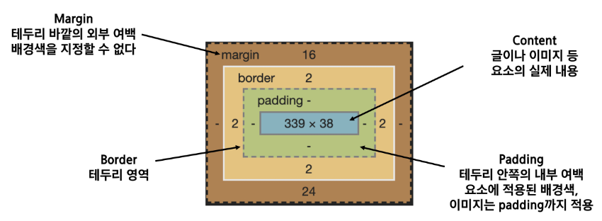

# 20230308

## CSS 기본기

#### CSS Box model

> CSS 원칙 1

- 네모네모하다~

- 인라인은 한 라인에 쪼갬 이런 느낌 컨텐트 영역만 (span 같은거)

- 블록레벨은 한 줄 싹다 이런 느낌

- 모든 요소는 네모(박스모델)이고, 위에서부터 아래로, 왼쪽에서 오른쪽으로 쌓인다. (좌측 상단에 배치)
  
  > Box model

- 모든 HTML요소는 box 형태로 되어있음

- 하나의 박스는 네 부분(영역)으로 이루어짐
  
  - content
  - padding
  - border
  - margin
    패딩입잖아. 컨텐트에 붙어있는게 바로 패딩
  
  
  .margin{
    margin-top:10px;
    margin-right:20px;
    margin-bottom:30px;
    margin-left:40px;
  }
  .margin-padding{
    margin:10px; #하나씩 들어있는경우
    padding:30px; #상하좌우 이렇게 만들어라
  }
  
  .border{
    border-width: 2px; #테두리.
    border-style:dashed;
    border-color:black;
  }
  shorthand를 통해서 표현 가능
  .margin-1{
  
  }
  1개쓸때: 상하좌우 다 10
  2개쓸때: 상하에는 10 좌우에는 20 주셈 (+)모양
  3개쓸때:ㅣ위쪽엔 10 좌우에 20주고 아래에 30주셈 (응 모양)
  4개쓸때: 시계방향, 위10 오20 아래30 좌40(시계방향)
  
  .border{
    border-width: 2px; #테두리.
    border-style:dashed;
    border-color:black;
  }
  를 
    .border{
    border: 2px dashed black;
  }
  로 표현 가능
  
  아무것도 설정하지않았을때, width는 보통 컨텐트 넓이 
  background-color은 컨텐트+ 패딩+
  우리가 일반적으로 영역을 볼 때는 border까지의 너비를 100px 보는 것을 원함
  
  - 그 경우 box-sizing을 border-box로 설정
    
    #### 개발자 도구

> 크롬 개발자 도구

- 웹 브라우저 크롬에서 제공하는 개발과 관련된 다양한 기능을 제공
- 주요 기능
  - Elements - 
  - Styles - 
  - Computed - 
  - Event Listeners - 
- Sources, Network, Performance, 

##### html 에밋

div.content < . 클래스
div.content*5 < 5개 만들어짐
div#my < # id
div.my-content>p#test*5
클래스를 my-content로 그 자식태그를 피태그로 만들건데 아이디를 테스트로 5개 만들어줘
lorem << 화면 디자인을 위해 의미없는 문장을 만들어줌
lorem*10 더 길게 만들기

##### css 에밋

margin-top: mt 
margin-bottom: mb
padding-top: pt
등등

> CSS 원칙 2

- display에 따라 크기와 배치가 달라진다.

#### CSS Display

> 대표적으로 활용되는 display

- display: block
  - 줄 바꿈이 일어나는 요소(다른 elem을 밀어낸다!)
  - 화면 크기 전체의 가로 폭을 차지한다
  - 블록 레벨 요소 안에 인라인 레벨 요소가 들어 갈 수 있음
- display: inline
  - 줄 바꿈이 일어나지 않는 행의 일부 요소
  - content를 마크업 하고 있는 만큼만 가로 폭을 차지한다.
  - width, height, margin-top, margin-bottom을 지정할 수 없다.
    
    <!-- - 상하 여백은 line-height로 지정한다 -->

> 블록 레벨 요소와 인라인 레벨 요소

- 블록 레벨 요소와 인라인 레벨 요소 구분(HTML 4.1까지)
- 대표적인 블록 요소
  - div/ ul, ol, li / p / hr/ form 등
- 대표적인 인라인 요소
  - span/ a/ img/ input, label/ b, em, i, strong 등

- display: inline-block
  - block과 inline 요소의 특징을 모두 가짐
  - inline처럼 한 줄에 표시 가능하고, block처럼 width, height, margin 속성을 모두 지정할 수 있음
- display: none
  - 해당 요소를 화면에 표시하지 않고, 공간조차 부여되지 않음
  - 이와 비슷한 visibility: hidden은 해당 요소가 공간은 차지하나 화면에 표시만 하지 않는다.
- 이외 다양한 display 속성은 https://developer.mozilla.org/ko/docs/Web/CSS/display

> CSS position

- 문서 상에서 요소의 위치를 지정(어떤 기준으로 어디에 배치시킬지)

- static : 모든 태그의 기본 값(기준 위치)
  
  - 일반적인 요소의 배치 순서에 따름(좌측 상단)
  - 부모 요소 내에서 배치될 때는 부모 요소의 위치를 기준으로 배치 됨

- 아래는 좌표 프로퍼티(top, bottom, left, right)를 사용하여 이동 가능

- relative: 상대 위치
  
  - 자기 자신의 static 위치를 기준으로 이동(normal flow 유지)
  - 레이아웃에서 요소가 차지하는 공간은 static 일 때와 같음(normal position 대비 offset)

- absolute: 절대 위치
  
  - 요소를 일반적인 문서 흐름에서 제거 후 레이아웃에 공간을 차지하지 않음(normal flow에서 벗어남)  
  - static이 아닌 가장 가까이 있는 부모/조상 요소를 기준으로 이동(없는 경우 body)

- fixed: 고정 위치
  
  - 요소를 일반적인 문서 흐름에서 제거 후 레이아웃에 공간을 차지하지 않음
  - 부모 요소와 관계없이 viewport를 기준으로 이동
  - 스크롤 시에도 항상 같은 곳에 위치함
