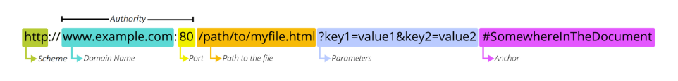

# 20230413

> HTTP

- 무상태, 비연결성

- Stateless(무상태)
  -
  
  - 

- > 대표 HTTP Request Methods
  > GET - READ / 서버에 리소스의 표현을 요청. GET을 사용하는 요청은 데이터만 검색해야 함
  > POST - CREATE / 데이터를 지정된 리소스에 제출. 서버의 상태를 변경
  > PUT - UPDATE / 요청한 주소의 리소스를 수정
  > DELETE- DELELE / 지정된 리소스를 삭제

> HTTP response status codes
> 100번대. 정보성.
> 200번대. 정상
> 300번대. 
> 400번대. 클라이언트 잘못
> 500번대. 서버 잘못

## URI

> URI

- Uniform Resource Identifier(통합 자원 식별자)
- 인터넷에서 리소스를 식별하는 문자열

> URN (통합 자원 이름)

- URI중에서 특정 이름 공간에서 이름으로 리소스를 식별하는 URI는 URN

> URL

- Locator(통합 자원 위치)
- 웹에서 주어진 리소스의 주소



Scheme (or protocol)

Autority

1. Domain Name
   
   - www~

2. Port
   
   - :
     Path
   - /로 구분

Parameters

- ?로 구분

Anchor

- #으로 구분

- 웹에서의 리소스 식별
  
  - 자원의 식별자(URI)
    - 자원의 **위치**로 자원을 식별(URL)
    - 고유한 **이름**으로 자원을 식별(URN)

## 클라이언트와 서버

클라이언트: 서비스 요청 주체

- Chrome or Firefox

서버: 요청에 대해 서비스를 응답하는 주체

- django 등

## REST API

> ###### API
> 
> Application Programming Interface

장고를 만들어놨어. 또는 다른 프레임워크로 응답을주는 방법을 만들어놨어.
 그럼 클라이언트는 어떻게 요청을해. URL로 하지. 아무 URL로 주면안되지 그건 이미 정해져있잖아. 장고는 어플리케이션이야. 

- 애플리케이션과 프로그래밍으로 소통하는 방법
  
  - 개발자가 복잡한 기능을 보다 쉽게 만들 수 있도록 프로그래밍 언어로 제공되는 구성

- API를 제공하는 애플리케이션과 다른 소프트웨어 및 하드웨어 등의 것들 사이의 간단한 계약(인터페이스)이라고 볼 수 있음

- API는 복잡한 코드를 추상화하여 대신 사용할 수 있는 몇 가지 더 쉬운 구문을 제공
  -
  
  - 
  - 
  - 

> ###### Web API

- 웹 서버 또는 웹 브라우저를 위한 API
- 현재 웹 개발은 모든 것을 하나부터 열까지 직접 개발하기보다 여러 Open API를 활용하는 추세

## Response

django template는 이제 사용 x 

JsonResponse()를 사용한 JSON 

> ###### serializer

- 직렬화
- 여러 시스템에서 활용하기 위해 데이터 구조나 객체 상태를 나중에 재구성 할 수 있는 포맷으로 변환하는 과정
  - 어떠한 언어나 환경에서도 "나중에 다시 쉽게 사용할 수 있는 포맷으로 변환하는 과정"
- 변환 포맷은 대표적으로 json, xml, yaml이 있으며 json이 가장 보편적으로 쓰임

> ###### django REST framework를 사용한 JSON 응답(1/4)

- Django REST framework(DRF) << pip install 필요
  -
- ```
  pip install djangorestframework
  ```

- - - 

Add 'rest_framework' to your INSTALLED_APPS setting.

- DRF의 

**[사용자 단축키 만들기]**

preferences
ㄴconfigure User snippets
ㄴNew global snippets file
ㄴglobal_snippets
chrome -> snippet generator
ㄴ원하는 양식 복붙, 
ㄴdescription:설명, 
ㄴtab trigger:단축키(파일이름이랑 똑같이(안헷갈리게)
ㄴcopy snippet -> global_snippets에 붙여넣기

**[테스트용 가짜데이터 삽입]**

$ pip install django-seed

setting.py에 app 추가

$ pip install psycopg2

$ python manage.py seed music --number=20

    #QuerySet 으로 리턴되는 경우

    #조회되는 데이터가 0개 이상인 경우

    #all(), filter()

'QuerySet' object has no attribute 에러 발생 시 들어오기 위해서

serializer = MusicSerializer(all_music, many=True) 처럼 many=True 설정

    #일반 객체로 리턴되는 경우 .get() (many 설정 필요 없음)

.accepted_renderer  에러 <<  @api_view 달아주기

from rest_framework.decorators import api_view 

## 