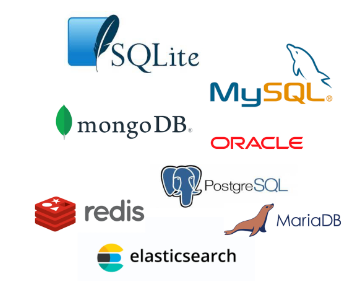
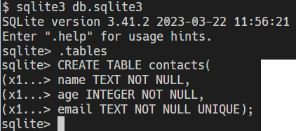
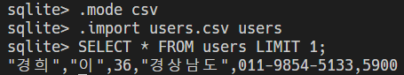
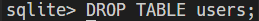
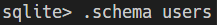

# 20230405

## DATA

저장이나 처리에 효율적인 형태로 변환된 정보

무한하게 증가하는 데이터
Kb -> Mb -> Gb -> Tb -> Pb -> Eb -> Zb -> Yb

> 데이터 센터의 성장

> 데이터는 뜨겁다

- 식혀줘야된다
- 바다로 보낸 MS의 프로젝트 Natick

###### 데이터 관리

- 개인은 일반적으로 데이터를 파일에 저장
  
  - 장점
  
  - 운영체제에 관계 없이 어디에서나 쉽게 사용가능
  
  - 이메일이나 메신저를 이용해 간편하게 전송 가능
  
  - 단점
  
  - 성능과 보안적 측면에서 한게가 명확
  
  - 대용량 데이터를 다루기에 적합x
  
  - 데이터를 구조적으로 정리하기 어려움
  
  - 확장이 불가능한 구조
    
    > 표(스프레드 시트)를 이용한 데이터 관리

- 무한하게 커질수 없음(100만 행 정도가 최대)

- 데이터 보안 측면

- 데이터 무결성 측면

## 데이터베이스

- 데이터를 어떻게 잘 관리 해 볼까

###### DBMS

(Database Management System)

- 데이터베이스를 조작하는 프로그램



> ###### 데이터베이스의 종류

| SQL(관계형 데이터베이스) | NoSQL(비관계형 데이터베이스)  No = not only |
| --------------- | --------------------------------- |
| 표형태(확장이 쉽지 않음)  |                                   |
| 형식이 정해져있다       |                                   |
| 성능문제            |                                   |

> ###### 비관계형 데이터베이스

- 서브 데이터베이스로 두고 빠른 처리, 확장이 필요한 기능에서 사용하는 경우가 많다.
- 채팅, 소셜 관계, 실시간 사진, 메세지 처리, 실시간 추천 등

> #### 데이터베이스 시작하기

- 데이터베이스를 조작하는 언어 SQL(Structured Query Language)
- 매우 직관적인 구조로 되어있음

## 관계형 데이터베이스

- 회원가입 Create
- 회원탈퇴 Delete
- 프로필 조회 Read
- 프로필 수정 Update
- 새로운 피드 작성 Create
- 좋아요 Create & Delete
  1번이 2번 좋아한대. 각 각 Create
- 팔로우 Create & Delete

> 관계형 데이터베이스(RDB)

- 데이터를 테이블 행, 열 등으로 나누어 구조화 하는 방식
- 구조화해서 저장하므로 보다 체게적으로 데이터를 저장하고 관리할 수 있음
- 자료를 여러 테이블로 나누어서 관리하고, 테이블간 관계를 설정해 여러 데이터를 조작할 수 있음
- 데이터의 무결성(정확성, 일관성) 유지에 장점이 있음
- SQL을 사용하여 데이터를 조회하고 조작

> ###### 관계형 데이터베이스의 구조

1. 스키마
   
   - 청사진. 테이블의 구조(Structure) 하나의 테이블에 id name address 등등이 있고 데이터타입은 text integer 뭐 이런걸 넣을거야

2. 테이블
   
   - 데이터가 직접 담기는 곳? 
   - 필드와 레코드를 사용해 조직된 데이터 요소들의 집합
   - 1 필드 세로(컬럼)
   - 2 레코드 가로(행)

3. PK 
- 테이블에 저장되어있는 각각의 레코드들을 구별해주는 고유값

- 데이터베이스 관리 및 테이블 간 관계 설정 시 주요하게 활용
4. FK(Foreign Key)
- 다른 테이블에 있는 PK를 저장해서 참조할 수 있게 하는 값

- 테이블 간의 관계를 만드는 데 사용할 수 있음

## SQL Commands

- 명령어는 특성에 따라 다음 세 가지 그룹으로 분류
  1. DDL (Data Definition Language)
  - 데이터 정의 언어
  2. DML (Data Manipulation Language)
  - 데이터 조작 언어
  3. DCL (Data )
  - SQLite는 파일로 관리되는 DB이기때문에 SQL을 이용한 접근 제한이 아닌 운영체제의 파일 접근 권한으로만 제어가능, SQLite에는 권한 설정을 담당하는 GRANT(권한부여)와 REVOKE(권한회수)는 지원하지 않아 DCL 부분은 우선 생략

> ###### SQL Syntax

- .

## DDL

> #### CREATE TABLE

CREATE TABLE 내가 원하는 테이블 이름(
테이블에 들어갈 필드를 적을건데
어떤 컬럼이름_어떤 데이터 타입을 가질건지_제약조건 이렇게 3가지파트
name TEXT NOT NULL
age INTEGER NOT NULL
email TEXT NOT NULL UNIQUE
)

> > ###### Data Types 종류(1/4)

1. NULL
   
   - 정보가 없거나 알 수 없음을 의미

2. INTEGER
   
   - 정수

3. REAL
   
   - 실수

4. TEXT
   
   - 문자 데이터

5. BLOB
   
   - 입력된 그대로 저장된 데이터 덩어리
   - 바이너리 등 멀티미디어 파일
   - ex) 이미지

> > ###### Constraints (제약조건)

- 데이터 무결성
  
  - 데이터 베이스 내의 데이터에 대한 정확성, 일관성을 보장하기 위해 데이터 변경 혹은 수정 시 여러 제한을 두어 데이터의 정확성을 보증하는 것
  - 무결성이란 데이터의 정확성, 일관성을 나타냄
1. NOT NULL
   
   - 컬럼이 NULL 값을 허용하지 않도록 지정
   - 기본적으로 테이블의 모든 컬럼은 NOT NULL 제약 조건을 명시적으로 사용하는 경우를 제외하고는 NULL 값을 허용함

2. UNIQUE
   
   - 컬럼의 모든 값이 서로 구별되거나 고유한 값이 되도록 함

3. PRIMARY KEY
   
   - 테이블에서 행의 고유성을 식별하는 데 사용되는 컬럼
   - 각 테이블에는하나의 기본 키만 있음

4. AUTOINCREMENT
   
   - 사용되지 않은 값이나 이전에 삭제된 행의 값을 재사용하는 것을 방지
   - INTEGER PRIMARY KEY 다음에 작성하면 해당 rowid를 다시 재사용하지 못하도록 함 

> rowid의 특징 row id 

- 테이블을 생성할 때마다 rowid라는 암시적 자동 증가 컬럼이 자동으로 생성됨
- 테이블의 행을 고유하게 식별하는 64비트 부호 있는 정수 값
- 테이블에 새행을 삽입할 때마다 정수 값을 자동으로 할당
5. 기타 Constraints

> #### ALTER TABLE

- 기본 테이블의 구조를 변경

```sql
<!-- Rename a table (테이블 이름 변경) -->
- ALTER TBLE table_name RENAME TO new_table_name;

- ALTER TABLE 이라는 키워드를 주고. 수정할 테이블을 명시하고. 뭐할건지. 적는다
  ALTER TABLE contacts RENAME TO new_contacts;

<!-- Rename a column (column 이름 변경) -->

- ALTER TABLE table_name RENAME COLUMN column_name TO new_column_name;

<!-- Add a new column to a table (테이블에 새 column 추가) -->

- ALTER TABLE new_contacts ADD COLUMN address_TEXT NOT NULL;

<!-- Delete a column --(column 삭제)>

- ALTER TABLE new_contacts DROP COLUMN ㅁ
```

## DML

> 사전준비

> ##### CSV 파일을 SQLite 테이블로 가져오기

## Simple query

- SELECT 문을 사용하여 간단하게 단일 테이블에서 데이터를 조회하기
  
  > SELECT statement
  
  SELECT 문은 SQLite에서 가장 복잡한 문
  다양한 절과 함께 사용할 수 
  있다.
  
  - ORDER BY
  - DISTINCT
  - 
  - 
  - 
  - 

SELECT * FROM 테이블명 -> 테이블 명에 있는 '모든' 컬럼 조회

## Sorting rows

ORDER BY

## Filtering data

- 데이터를 필터링하여 중복 제거, 조건 설정 등 쿼리를 제어하기
- Clause
  - SELECT DISTINCT
  - WHERE
  - LIMIT
- Operator
  - LIKE
  - IN
  - BETWEEN

###### SELECT DISTINCT clause

```sql
SELECT DISTINCT select_list FROM table_name;
```

- 조회 결과에서 중복된 행을 제거

- DISTINCT 절은 SELECT 에서 선택적으로 사용할 수 있는 절

- 문법 규칙
  
  - DISTINCT 절은 SELECT 키워드 바로 뒤에 나타나야 함
  
  - DISTINCT 키워드 뒤에 컬럼 또는컬럼 목록을 작성

LIKE operator

- SELECT, DELETE, UPDATE 문의 WHERE 절에서 사용

- 1. %(percent)
     
     - 0개 이상의 문자가 올 수 있음을 의미
     
     - '영%' 는 영으로 시작하는 모든 문자열과 일치
     
     - '%도' 패턴은 도로 끝나는 모든 문자열과 일치
     
     - '%강원%' 패턴은 강원을 포함하는 모든 문자열과 일치
  
  2. _(underscore)
     
     - 단일(1개) 문자가 있음을 의미
     
     - '영_' 패턴은 영으로 시작하고 총 2자리
     
     - '_도' 패턴은 도로 끝나고 총 2자리

IN operator

BETWEEN operator

- 값이 범위에 있는지 테스트

- <-> NOT BETWEEN

LIMIT clause

- SELECT 문에서 선택적으로 사용할 수 있는 절
- row_count는 반환되는 행 수를 지정하는 양의 정수를 의미

OFFSET keyword

- LIMIT과 쓰면 특정 지정위치에서부터 데이터를 조회할 수 있음

=======================================================================

BASH sqlite3로 만들기



DML- csv 파일 불러오기 

 users의 모든 cloumn에 젤 위에 한줄만 불러줘



테이블 삭제 



스키마 보기


