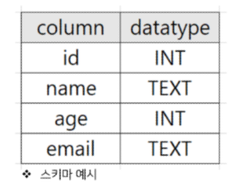
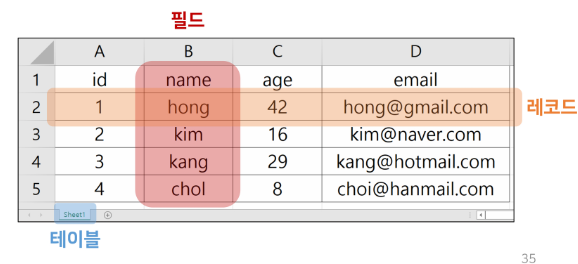
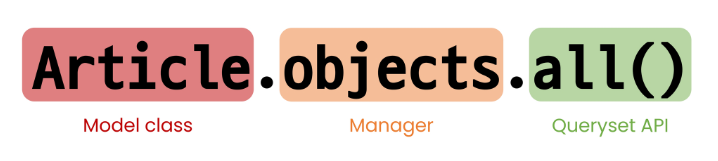
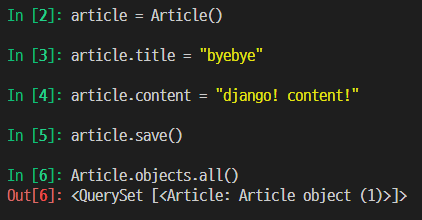
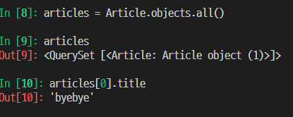

# 20230316

## Form&Data

> Sending and Retrueving form data

- 데이터를 보내고 가져오기
- HTML form elelment를 통해 사용자와 애플리케이션 간의 상호작용 이해하기

> Client & Server architecture

#### Sending form data(Client)

> ###### HTML <form> element

- 데이터가 전송되는 방법을 정의
- 웹에서 사용자 정보를 입력하는 여러 방식(text, botton, submit 등)을 제공하고, **사용자로부터 할당된 데이터를 서버로 전송**하는 역할을 담당
- '데이터를 어디(action)로 어떤 방식(method)으로 보낼지'
- 핵심 속성
  - action
  - method

> ###### HTML form's attributes

1. action
   - 입력 데이터가 전송될 URL을 지정
   - 데이터를 
   - 
2. method
   -
   - 
   - 

> ###### HTML <input> element

- 사용자로부터 데이터를 입력받기위해 사용

- type 속성에 따라 동작 방식이 달라진다.
  -
  
  - 

- 핵심 속성
  -

> ###### HTML input's attribute

- name
  -
  - 

> ###### HTTP request methods

- > GET
  - 데이터를 가져올 때만 사용해야 함
  - 데이터를 서버로 전송할 때 Query String Parameters를 통해 전송
- > GET메서드 작성

> ###### Query String Parameters

- 사용자가 입력 데이터를 전달하는 방법 중 하나로, 'url 주소'에 데이터를 파라미터를 통해 넘기는 것
- 이러한 문자열은 앰퍼샌드(&)로 연결된 key=value 쌍으로 구성되며 기본 URL과 물음표(?)로 구분됨
  - 예시
  - http://host:port/path?key=value&key=value
- Query String이라고도 함
- ?를 쓰는것으로 Query String이 시작함을 알림

#### Retrieving the data(Server)

> ###### d

## Django Model

> 개요

- Model의 핵심개념과 ORM을 통한 데이터베이스 조작 이해
- django는 웹 애플리케이션의 데이터를 구조화하고 조작하기위한 추상적인 계층(모델)을 제공

#### Database

> ###### Database

- 체계화된 데이터의 모임
- 검색 및 구조화 같은 작업을 보다 쉽게하기위해 조직화된 데이터를 수집하는 저장 시스템

> ###### Database 기본 구조

1. 스키마(Schema)
2. 테이블(Table)

> ###### 스키마

- 뼈대(Structure)
- 데이터베이스에서 자료의 구조, 표현 방법, 관계 등을 정의한 구조

> ###### 테이블(Table)

- 필드와 레코드를 사용해 조직된 데이터 요소들의 집합
- 관계(Relation)라고도 부름
1. 필드(field)
   - 속성, 컬럼(Column)
   - 각 필드에는 고유한 데이터 형식이 지정됨
     - INT, TEXT 등
2. 레코드(record)
   - 튜플, 행(Row)
   - 테이블의 데이터는 레코드에 저장됨
   - 예를 들어 해당 예시는 4명의 고객정보가 저장되어 있으며, 레코드는 4개가 존재

> ###### PK(Primary Key)
> 
> 예시에서는 A라인

- 기본 키
- 각 레코드의 고유한 값(식별자로 사용)
- 기술적으로 다른 항목과 절대로 중복될 수 없는 단일 값(unique)
- 데이터베이스 관리 및 테이블 간 관계 설정 시 주요하게 활용 됨
  ex '주민등록번호'

> ###### 쿼리(Query)

- 데이터를 조회하기 위한 명령어
- 조건에 맞는 데이터를 추출하거나 조작하는 명령어
  (주로 테이블형 자료구조에서)
- "Query를 날린다."
  - "데이터베이스를 조작한다."

## Model

django는 model을 통해 데이터에 접근하고 조작.
사용하는 데이터들의 필수적인 필드들과 동작들을 포함
저장된 데이터베이스의 구조(layout)
일반적으로 각각의 모델은 하나의 데이터베이스 테이블에 매핑(mapping)

- 모델 클래스 1개 == 데이터베이스 테이블 1개

> ###### Model 작성하기

- models.py 작성
- 모델 클래스를 작성하는 것은 데이터베이스 테이블의 스키마를 정의하는 것
- "모델 클래스 == 테이블 스키마"

datefield

## Migrations

Django가 모델에 생긴 변화(필드 추가, 수정 등)를 실제 DB에 반영하는 방법

> ###### Migrations 관련 주요 명령어

1. makemigrations 지금 내 모델 상태를 데이터베이스에 반영할 수 있는 하나의 마이그레이션 상태로 만들어준다. 
   $ python manage.py makemigrations

2. migrate 내가 만든 하나의 마이그레이션 파일을. 실제 데이터베이스에 반영하도록.
   $ python manage.py migrate

> ###### [참고] Migrations 기타 명령어

1. showmigrations

2. sqlmigrate

> 반드시 기억해야 할 migration 3단계

1. models.py에서 변경사항이 발생하면
2. migration 생성
- makemigrations
3. DB 반영 (모델과 DB의 동기화)
- migrate

> 

## ORM

> ###### ORM 장단점

- 장점
  - SQL을 잘 알지 못해도
- 단점
  -

## QuerySet API

> Database API 구문

Article.objects.all()

> ###### objects manager

- 
- 
- 
- 

> ###### Query

- 데이터베이스에 특정한 데이터를 보여 달라는 요청
  - "쿼리문을 작성한다"
  - 원하는
- 이 때, 파이썬으로 작성한 코드가 ORM에 의해 SQL로 변환되어 데이터베이스에 전달되며, 데이터베이스의 응답 데이터를 ORM이 QuerySet이라는 자료 형태로 변환하여 우리에게 전달

> ###### QuerySet

- 데이터베이스에게서 전달 받은 객체 목록(데이터 모음)
  - 순회가 가능한 데이터로써 1개 이상의 데이터를 불러와 사용할 수 있음
- Django ORM을 통해 만들어진 자료형이며, 필터를 걸거나 정렬 등을 수행할 수 있음

## CRUD

- Create / Read / Update / Delete
  - 생성/ 조회/ 수정/ 삭제
- 대부분의 컴퓨터 소프트웨어가 가지는 기본적인 데이터 처리 기능 4가지를 묶어서 일컫는 말

#### CREATE

> 데이터 객체를 만드는(생성하는) 3가지 방법

- 첫번째 방법
  1. article = Article()
  - 클래스를 통한 인스턴스 생성
  2. article.title
  - 클래스 변수명과 같은 이름의 인스턴스 변수를 생성 후 값 할당
  3. article.save()
  - 인스턴스로 save 메서드 호출
- 
- 