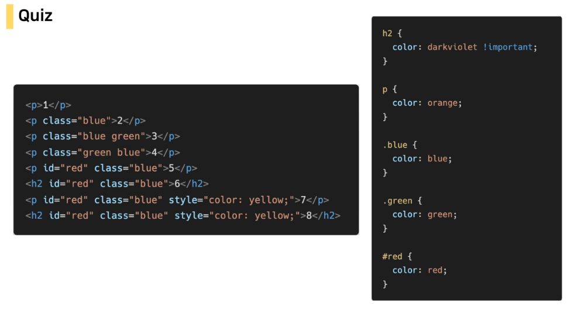
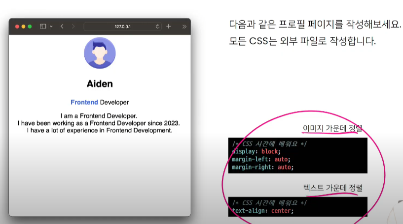

# 20230307

## HTML

- HTML 이해하기
- HTML 기본구조
- HTML 문서 구조화

#### HTML과 CSS 그리고 JavaScript

HTML => 구조(레이아웃) 웹주간
HTML + CSS => 표현(스타일링) 웹주간
HTML + CSS + JS => 동작(인터렉션)

## HTML

- Hyper Text Markup Language

- 웹 페이지를 작성(구조화)하기 위한 언어
  
  > Markup Language

- 태그 등을 이용하여 문서나 데이터의 구조를 명시하는 언어
  
  - 대표적인 예 - HTML, Mark down

모르는 부분 찾아보기
MDN , W3Schools

#### HTML 기본 구조

- head 헤드
  - title
  - link
  - style
- 
- 

> 요소(element)

- 여는태그<> + 내용 +  닫는태그</>
  
  <h1>내용</h1>
  여는태그와 닫는태그가 하나인 것도 있다 <Tag   />

- 내용이 없는 태그들
  
  - br(줄바꿈), hr, img, input, link, meta

- 요소는 중첩될 수 있음
  
  - 요소의 중첩을 통해 하나의 문서를 구조화
  - 여는 태그와 닫는 태그의 쌍을 잘 확인해야함
    - 오류를 반환하지않고 레이아웃이 깨진 상태로 출력되기 때문. 디버깅힘듬

> 속성(attribute)

- 속성명과 속성값으로 구성
  - 여는 태그 안에 넣어야함
  - 속성 지정 스타일 가이드
  - 쌍따옴표 공백 NO

> 주석

<!-- 내용 -->

ㅇ

<!DO

<h1>

Portfolio</h1>

<h2>My name is Aiden</h2>

## CSS

- Cascading Style Sheets
  스타일을 지정하기 위한 언어
  선택하고, 스타일을 지정한다

개발자 도구. 크롬에서 F12 

#### CSS Selector

> 선택자(Selector) 유형

- 기본 선택자
  - 전체 선택자(*), 요소(tag)선택자
  - 클래스(class) 선택자, 아이디(ID) 선택자, 속성(attr) 선택자
- 결합자()
  - 자손 결합자, 자식 결합자

class와 id의 차이.
class는 여러번 쓸 때
id는 딱 하나만. 찍고싶을때? 근데 뭐 여러군데 쓸수도 있음

외부참조 내부참조 동시에 가능

> CSS 적용 우선순위
> 인라인 > id > class,속성 > 요소

→ 시험 나올까

1 오렌지

2 블루

3 그린. <<블 그 둘다줬는데 css파일의 순서대로(html xx)

4 그린. <<

5 레드

6 다크바이올렛

7  옐로우?

8 다크바이올렛

> CSS 상속

속성(프로퍼티) 중에는 상속이 되지 않는 것이 있다.

